# Resource Assignment Refactor - Structure and Sequence Diagrams

Companion to [resource-assignment-refactor-plan.md](resource-assignment-refactor-plan.md). Nothing
here is new design; it is the plan's §2-§11 drawn out. Section references point back at the source
of each element.

## 1. Domain Model (§3, §3.1, §4, §4.1)

Value types only - no I/O, no technology. `ResourcePlan` is what was *decided*; `Reservation` is
what was *recorded* and is the only thing that survives the process.

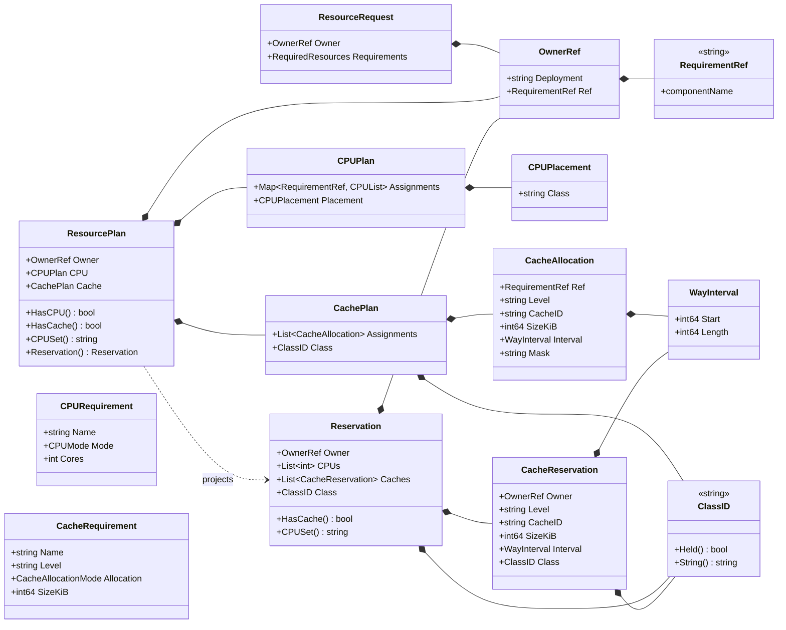

- `RequirementRef` is `components[].name`, trimmed - the whole identity (§4.1).
- `ClassID` is opaque: `""` is unset, `"0"` is COS 0 (R1.47).
- `CPUPlacement.Class` holds a balloon name, empty for direct pinning.
- `CachePlan.Class` is reserved during `PlanCache` and is `ClassUnset` when no cache is requested.
- `ResourceRequest` deliberately carries no allocation state.

## 2. Allocation State (§3.1)

The split R1.4 asked for: an immutable read, and a mutable per-deployment accumulator. The ledger
is the **single allocator** for every scarce pool - isolated CPUs, cache ways, class slots. The
`ClassNamer` is *not* a second allocator: the ledger grants the slot and enforces the cap, and the
namer only supplies the runtime's spelling (R1.10, R1.47).

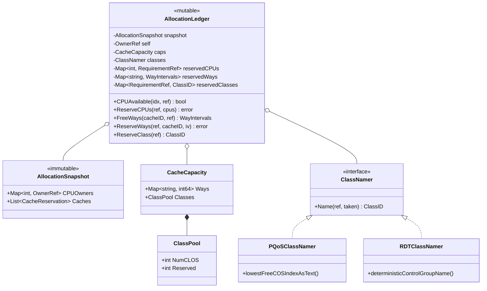

One ledger exists per deployment reconcile. `ClassPool` comes from the topology artifact (R1.45).
`ReserveClass` is the only caller of `ClassNamer.Name`. Nothing else reaches the namer, and no
implementation of it carries a capacity limit - which is why `ErrCapacityExhausted` can only come
from the ledger.

### Ownership predicate (§3.1 table)

One rule, applied identically to CPU indices and cache ways (R1.48 part 1).

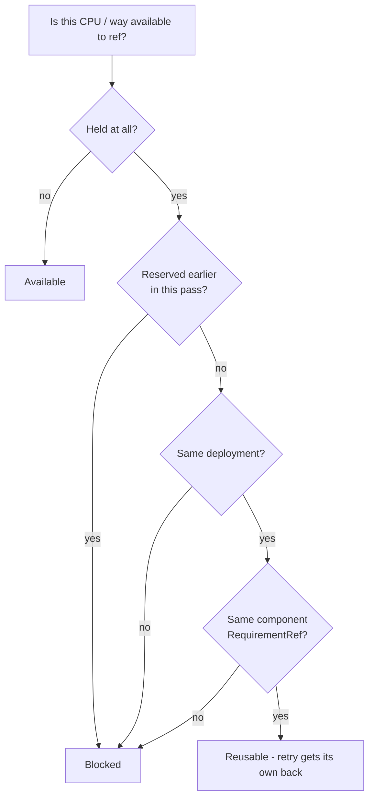

## 3. Capabilities and Runtime Bundle (§2.1, §5-§8)

One variation point - the runtime. The factory is the only place a CPU planner is paired with an
isolation controller, so an invalid combination cannot be constructed.

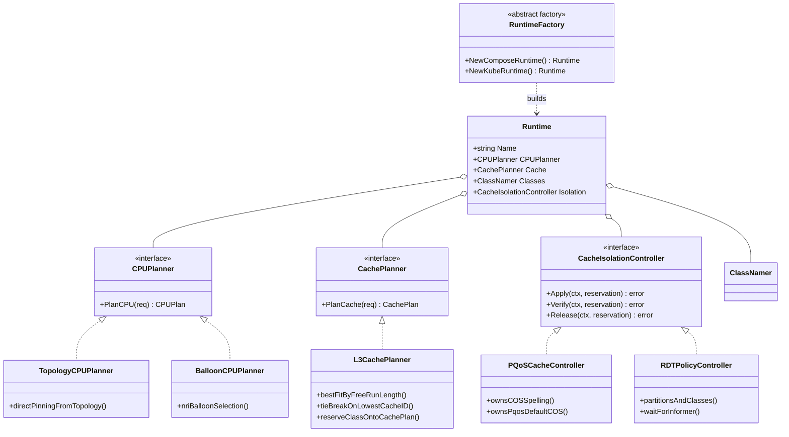

| Capability | Compose runtime | Kube runtime |
|---|---|---|
| CPU planning | `TopologyCPUPlanner` | `BalloonCPUPlanner` |
| Cache planning | `L3CachePlanner` | `L3CachePlanner` |
| Class naming | `PQoSClassNamer` | `RDTClassNamer` |
| Cache isolation | `PQoSCacheController` | `RDTPolicyController` |
| Deployment config | `ComposeConfigurator` | `HelmConfigurator` |

## 4. Coordinator, Ports and Configurators (§7, §9, §10)

`ResourceCoordinator` is non-generic (R1.2). Configurators are **not** in the bundle and share no
interface - their inputs and outputs differ, and only Compose produces an artifact.

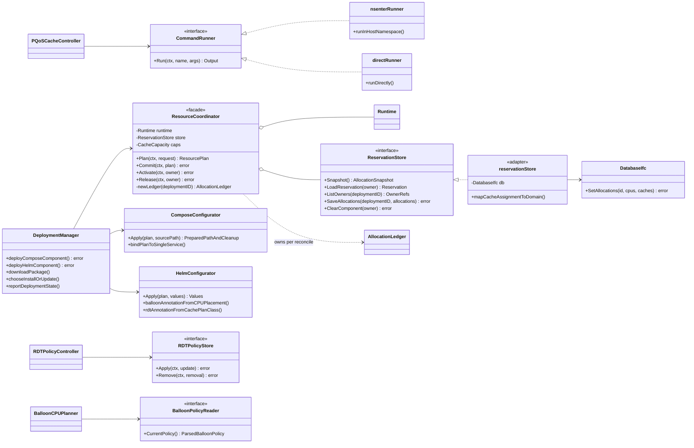

`DatabaseIfc.SetAllocations` is one lock acquisition, one notification, one queued persist (§9.1).
`DeploymentManager` holds no masks, balloons, YAML nodes, or PQoS knowledge.

## 5. Sequence - Compose deploy, happy path (§10)

Note the two orderings the plan makes invariant: `Commit` persists **before** it applies isolation,
and isolation is in force **before** the workload starts (§8, R1.42).

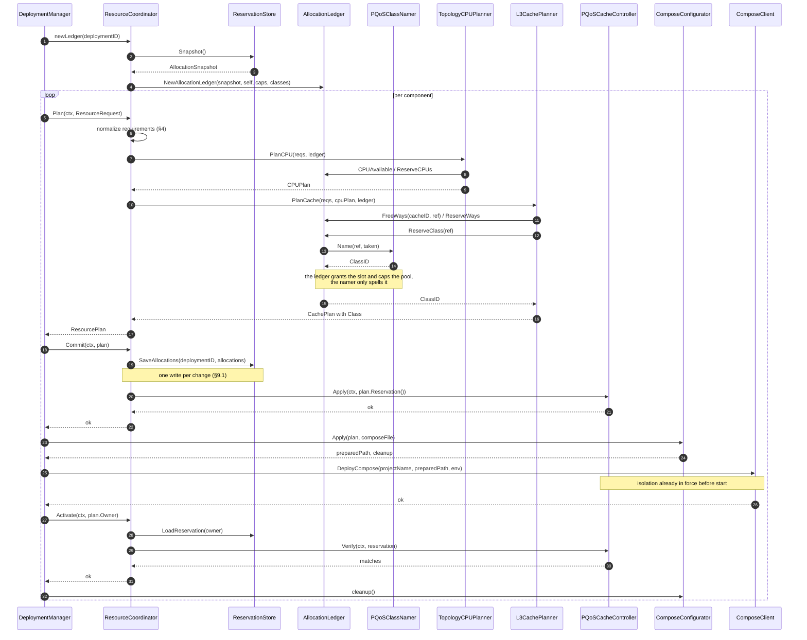

## 6. Sequence - Helm deploy (§10)

Same lifecycle, different strategies; the only structural difference is that the configurator
returns values rather than a file, so there is no cleanup.

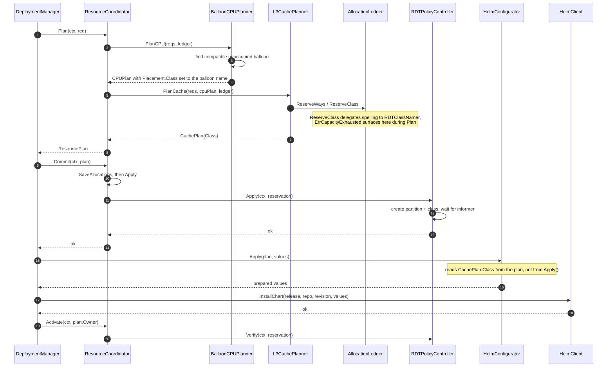

## 7. Sequence - Rollback on failure (§10.1, §11)

One `defer` per component, a named `err` return, and a detached context so a cancelled deploy still
gets rolled back. Release reads back what actually landed rather than releasing the in-memory plan.

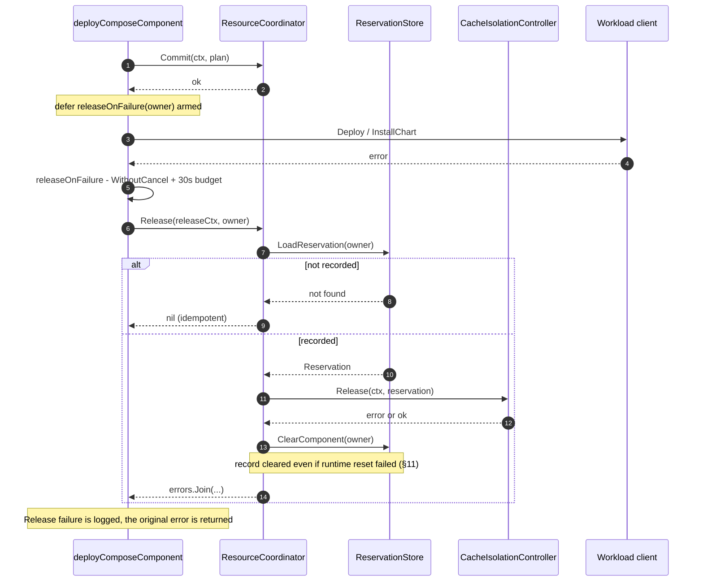

## 8. Sequence - Removal and post-restart repair (§8, §11)

Both paths run without any in-memory plan or handle - the whole point of R1.49.

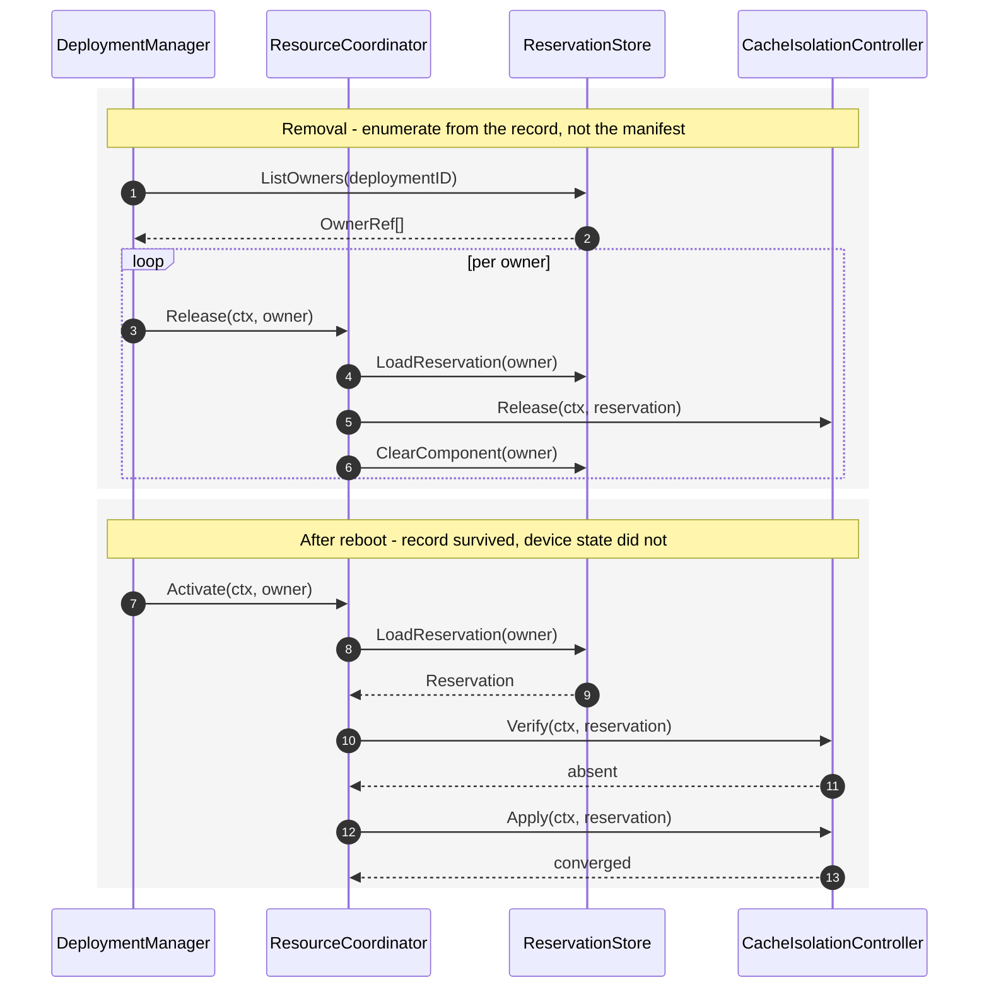

## 9. Lifecycle states (§8, §11)

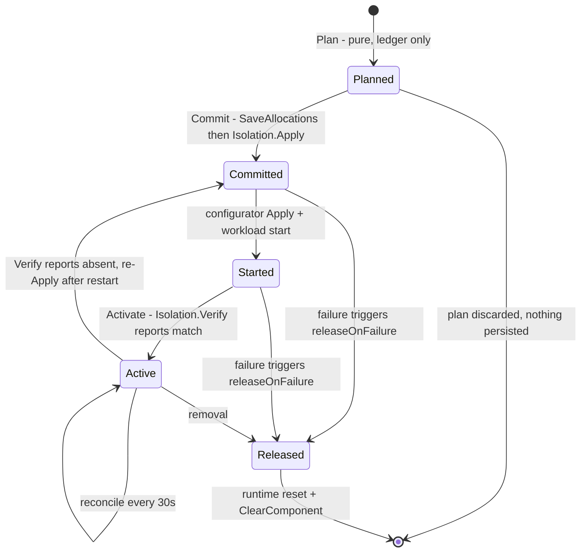

## 10. What each layer may not do (§15 guardrails)

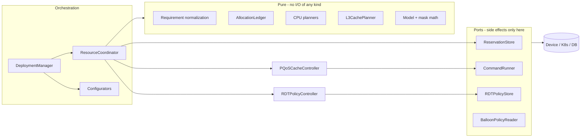

Guardrails these diagrams are meant to make checkable:

- Nothing in **Pure** touches the database, filesystem, shell, or Kubernetes.
- `DeploymentManager` reaches the device only through `ResourceCoordinator` and the configurators.
- Only `reservationStore` imports `database`; only `*_runner.go` imports `os/exec`.
- Every scarce pool - isolated CPUs, cache ways, class slots - has exactly one allocator: the ledger.
  `ClassNamer` supplies spelling only and never a cap.
- Identity is constructed in exactly one place: requirement normalization (§4.1).
```
