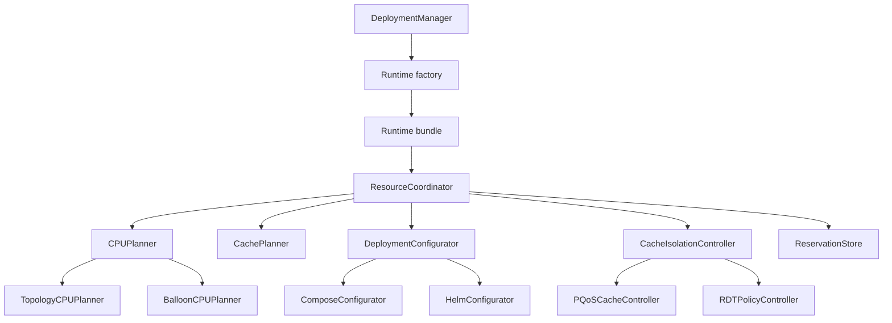

# Resource Assignment Refactor Plan

## 1. Objective

Refactor the four resource-assignment files so that:

- CPU planning is one capability with Compose and Helm strategies.
- Cache allocation is shared and independent of deployment technology.
- Deployment mutation is one capability with Compose YAML and Helm values strategies.
- Cache isolation is one lifecycle with PQoS and Kubernetes RDT strategies.
- `DeploymentManager` coordinates deployments without implementing resource policy.
- Planning is deterministic and side-effect free.
- External operations are isolated behind small, consumer-owned interfaces.
- Existing behavior is preserved and characterized by tests before it is moved.

The target is Go-style composition, not inheritance or an interface for every type.

## 2. Target Architecture



Two coordinators use the same workflow but different strategies:

| Capability | Compose | Helm |
|---|---|---|
| CPU planning | `TopologyCPUPlanner` | `BalloonCPUPlanner` |
| Cache planning | Shared `L3CachePlanner` | Shared `L3CachePlanner` |
| Deployment configuration | `ComposeConfigurator` | `HelmConfigurator` |
| Cache isolation | `PQoSCacheController` | `RDTPolicyController` |

### 2.1 Runtime Bundle

There is exactly one variation point - the runtime - and the table above is its definition. The
strategies are therefore not injected independently. A runtime factory produces the whole
consistent bundle, so an invalid combination such as `TopologyCPUPlanner` + `RDTPolicyController`
cannot be constructed.

```go
type Runtime struct {
    Name       string
    CPUPlanner CPUPlanner
    Cache      CachePlanner
    Classes    ClassNamer
    Isolation  CacheIsolationController
}

func NewComposeRuntime(...) Runtime // Topology CPU planning + PQoS isolation
func NewKubeRuntime(...) Runtime    // Balloon CPU planning + RDT policy isolation
```

Rules:

- The factory functions are the only place that pairs a CPU planner with an isolation controller.
- `ResourceCoordinator` takes a `Runtime` and never selects strategies itself.
- `CachePlanner` is part of the bundle even though both runtimes use `L3CachePlanner`, so the
  coordinator has a single dependency source and a future runtime can substitute it.
- `ClassNamer` is in the bundle but is **not** a fifth strategy the coordinator drives: it is
  consumed by the `AllocationLedger` the coordinator builds (§3.1), which owns the pool and the cap.
  It is in the bundle because the class-of-service *pool* is shared hardware while the *spelling* is
  runtime-specific: PQoS picks the COS index, resctrl assigns it and the agent addresses the group
  by name (R1.45). Pairing the wrong namer with a runtime would mint identifiers the isolation
  controller cannot use. It was called `ClassAllocator` until 01/09/2026; it does not allocate, and
  the old name invited the question of why it was not part of the cache planner (R1.10).
- Adding a runtime means adding one factory function and one dispatch entry, not touching three
  injection sites.

Deployment configuration is deliberately *not* in the bundle: its input type is
technology-specific, so it is selected at the call site rather than carried through the shared
coordinator. See §7.

## 3. Shared Domain Model

Replace parallel maps, backend annotations, and `has...` booleans with typed plans.

```go
type ResourceRequest struct {
    Owner        OwnerRef // §3.1; deployment plus component, the whole identity per §4.1
    Requirements *sbi.RequiredResources
}

type ResourcePlan struct {
    Owner OwnerRef
    CPU   CPUPlan
    Cache CachePlan
}

type CPUPlan struct {
    Assignments map[RequirementRef][]int // see R1.11 for making this per-assignment
    Placement   CPUPlacement
}

type CPUPlacement struct {
    Class string // Balloon name when one is required.
}

type CachePlan struct {
    Assignments []CacheAllocation
    Class       ClassID // reserved during PlanCache; ClassUnset when no cache is requested
}

type CacheAllocation struct {
    Ref      RequirementRef // §4.1; replaces the old RequirementName/ComponentName pair
    Level    string
    CacheID  string
    SizeKiB  int64
    Interval WayInterval
    Mask     string
}

// Reservation is one component's committed allocation. Every field is persisted, so
// it can be rebuilt from the record alone with no in-memory state (R1.49). It is the
// input to every CacheIsolationController method (§8) and the unit the repository
// loads and clears (§9).
type Reservation struct {
    Owner  OwnerRef
    CPUs   []int
    Caches []CacheReservation
    Class  ClassID
}

func (r Reservation) HasCache() bool { return len(r.Caches) > 0 }
func (r Reservation) CPUSet() string // "8,9"; the home for today's formatCPUSet (R1.13)
```

`ResourcePlan` should provide methods such as `HasCPU()`, `HasCache()`, `CPUSet()`, and
`Reservation()`, which projects the plan onto the value `Commit` persists.

`ResourcePlan` and `Reservation` are the two halves of the same allocation: the plan is what was
*decided*, the reservation is what was *recorded*. Only the plan carries intervals, masks, and
placement, because only planning needs them; only the reservation survives the process. Every
lifecycle stage after `Commit` takes the reservation, so a stage never depends on a plan it may not
have computed - see R1.49 and the §8 contract.

`ResourceRequest` deliberately carries **no** allocation state. Free-versus-taken is answered by the
ledger in §3.1, which the coordinator owns for the whole deployment rather than passing per
component.

Tool-specific details do not belong in the plan:

- Balloon annotation keys belong in `HelmConfigurator`.
- Classes of service are reserved by the ledger (§3.1) from one device-wide pool shared by PQoS and
  RDT and carried on `CachePlan.Class`; only their *application* belongs to the isolation
  controllers. `CachePlan.Class` is to the cache plan what `CPUPlacement` is to the CPU plan - a
  reserved identifier a configurator reads, not a mechanism detail.
- RDT partition names belong in the RDT controller.
- Compose temporary paths belong in `ComposeConfigurator`.

### 3.1 Allocation Snapshot and Ledger

Allocation state is two different things and gets two different types. `AllocationSnapshot` is an
immutable read of what is already persisted. `AllocationLedger` is the mutable accumulator that
records what this reconcile pass has handed out but has not yet written. Merging them into one
struct is what produces today's duplicated copy/merge code and makes the word "snapshot" untrue.

```go
// AllocationSnapshot is a device-wide read of persisted allocations, taken once per reconcile.
// It is never mutated after construction.
type AllocationSnapshot struct {
    CPUOwners map[int]OwnerRef
    Caches    []CacheReservation
}

type OwnerRef struct {
    Deployment string
    Ref        RequirementRef
}

// CacheReservation is the domain form of a persisted cache allocation (see R1.5).
// The repository maps it to and from database.CacheAssignment.
type CacheReservation struct {
    Owner    OwnerRef
    Level    string
    CacheID  string
    SizeKiB  int64
    Interval WayInterval
    Class    ClassID
}

// ClassID identifies one reserved slot in the device-wide class-of-service pool.
// The pool is shared hardware; only the spelling is runtime-specific - PQoS uses a
// COS index, resctrl a control-group name - and both are strings wherever they are
// applied, so one opaque type covers both (R1.47).
type ClassID string

// ClassUnset means no slot is held. "0" is COS 0, a real class that is never
// allocated, so the two can no longer be conflated.
const ClassUnset ClassID = ""

func (c ClassID) Held() bool     { return c != ClassUnset }
func (c ClassID) String() string { return string(c) }

// ClassNamer spells a slot the ledger has already confirmed is free. It comes
// from the runtime bundle (§2.1) and is reached only through the ledger. taken
// lists every class held device-wide, so an index-addressed mechanism can choose an
// unused number; it never enforces the cap, which is the ledger's alone.
type ClassNamer interface {
    Name(ref RequirementRef, taken []ClassID) (ClassID, error)
}

// PQoSClassNamer returns the lowest free COS index as decimal text. It is the
// only code that needs the identifier ordered, so the index floor and the COS 0
// default live beside it in pqos_cache_controller.go rather than in the domain.
// RDTClassNamer returns a deterministic name for ref; it is the single home for
// the class-naming rule, which the current code spells out twice as
// componentName + "_class".

type WayInterval struct {
    Start  int64
    Length int64
}

// ClassPool is the device-wide hardware limit on classes of service. resctrl
// exposes num_closids per level; the usable count is the minimum across the levels
// present, because one control group consumes a CLOS in all of them. PQoS and RDT
// draw from this same pool.
type ClassPool struct {
    NumCLOS  int // from the topology artifact; see §13
    Reserved int // slots the agent does not own, e.g. resctrl's default group
}

// CacheCapacity is the device inventory the ledger needs to answer "what is free".
// Both fields come from the topology artifact.
type CacheCapacity struct {
    Ways    map[string]int64
    Classes ClassPool
}
```

The repository maps persisted values at the boundary. `database.CacheAssignment` carries the class
in one field, `Class string \`json:"class,omitempty"\``, which **replaces** today's
`ClassID int \`json:"classId,omitempty"\``. One field serves both runtimes: an RDT reservation stores
its control-group name, a PQoS reservation stores its COS index as decimal text. Empty means no slot
is held.

Storing the class is required, not cosmetic. Without it a reloaded reservation is
indistinguishable from one holding no class, so the ledger would under-count the pool after an agent
restart and over-allocate (R1.45). Collapsing to one field also removes the `omitempty` hazard the
old `int` had, where a genuine COS 0 would vanish on write.

The stored format changes outright - there is no `classId` fallback and no migration. Records
written before this change lose their class on reload, which is acceptable while the agent is
pre-release (R1.47).

The ledger is scoped to one deployment. It holds the snapshot, the identity of the deployment being
planned, and the device inventory, and it accumulates this pass's reservations separately from the
persisted ones.

```go
type AllocationLedger struct {
    snapshot AllocationSnapshot
    self     OwnerRef
    caps     CacheCapacity
    classes  ClassNamer // supplied by the runtime bundle (§2.1)

    reservedCPUs    map[int]RequirementRef
    reservedWays    map[string][]WayInterval
    reservedClasses map[RequirementRef]ClassID
}

func NewAllocationLedger(
    snapshot AllocationSnapshot,
    self OwnerRef,
    caps CacheCapacity,
    classes ClassNamer,
) *AllocationLedger

// CPUAvailable reports whether ref may take idx: free, or already owned by ref itself.
func (l *AllocationLedger) CPUAvailable(idx int, ref RequirementRef) bool

// ReserveCPUs records an exclusive claim. Fails if any index is unavailable.
func (l *AllocationLedger) ReserveCPUs(ref RequirementRef, cpus []int) error

// FreeWays returns the contiguous way intervals on cacheID that ref may take: unused,
// or already persisted to ref itself. Ways held by another deployment, by a sibling
// component of this deployment, or reserved earlier in this pass are excluded.
// It takes ref for the same reason CPUAvailable does - self-ownership is keyed on the
// component, not the deployment (R1.48).
func (l *AllocationLedger) FreeWays(cacheID string, ref RequirementRef) []WayInterval

func (l *AllocationLedger) ReserveWays(ref RequirementRef, cacheID string, iv WayInterval) error

// ReserveClass takes one slot from the device-wide class pool and delegates
// naming to the runtime's namer. Fails with ErrCapacityExhausted once
// NumCLOS-Reserved slots are held, counting persisted and in-flight together.
func (l *AllocationLedger) ReserveClass(ref RequirementRef) (ClassID, error)
```

**Ownership is four-way, not two-way.** This is the semantic the current code expresses through
string prefixes and separate map parameters, and it is the reason the snapshot and the pass's
reservations must stay in separate fields inside the ledger:

| Holder | CPU | Cache ways |
|---|---|---|
| Another deployment | blocked | blocked |
| This deployment, persisted, **same** component | **reusable** - a retry gets its own back | **reusable** |
| This deployment, persisted, **other** component | blocked | blocked |
| This deployment, reserved earlier in this pass | blocked | blocked |

Since §4.1 the component name is the whole identity, so "same component" and "same requirement" are
the same test. **Every pool uses the same predicate**, which is why `CPUAvailable` and `FreeWays`
both take a `RequirementRef`: self-ownership is keyed on the component, never on the deployment.

The third row is a **behaviour change decided 31/08/2026** and is the whole of R1.48 part 1. Today
the two resources disagree: the CPU path reuses only allocations owned by the same requirement,
while the cache path skips *every* self-owned persisted allocation via a
`strings.HasPrefix(owner, deploymentID+"/")` test, so on a later reconcile one component can be
planned onto ways a running sibling still holds - silently, because nothing errors. The CPU rule is
the correct one and the cache rule is made to match it.

The second row is a separate question and is **still open** as R1.48 part 2: whether implicit reuse
of a live self-owned reservation should exist at all, or be replaced by an explicit
unchanged/changed comparison on the update path. That is a change to deployment semantics rather
than to an ownership predicate, so it is deliberately not bundled here; the row stands as written
until it is decided.

**Lifecycle.** The snapshot is taken **once per reconcile of one deployment, inside the coordinator,
before the component loop** - not once per component, which is what today's four independent
`AllocatedCpus()` / `AllocatedCaches()` calls amount to. One ledger is then threaded through every
component of that deployment.

```go
func (c *ResourceCoordinator) newLedger(deploymentID string) (*AllocationLedger, error) {
    snapshot, err := c.store.Snapshot() // device-wide; every deployment's allocations
    if err != nil {
        return nil, err
    }
    return NewAllocationLedger(
        snapshot,
        OwnerRef{Deployment: deploymentID},
        c.caps,
        c.runtime.Classes,
    ), nil
}
```

Rules:

- Planners receive an `*AllocationLedger` and no persisted maps, no in-flight maps, and no
  deployment ID.
- Planners perform no I/O. They mutate only the ledger, which is in-memory and discardable.
- The ledger is the single allocator for every scarce pool - isolated CPU indices, cache ways, and
  classes of service. No other component may reserve from those pools (R1.8, R1.45).
- Self-ownership is keyed on the component for every pool. There is no deployment-wide exemption,
  so a sibling's persisted claim is as blocking as another deployment's (R1.48 part 1).
- The class pool is shared hardware. A slot taken by the RDT runtime is unavailable to PQoS and
  vice versa, so the count spans both (R1.45).
- The ledger owns the pool and the cap; the namer only supplies the runtime's spelling. No
  caller invokes `ClassNamer` directly, and no implementation of it carries a capacity limit.
- The snapshot's creation point defines the boundary R1.30's device-wide lock must cover: a plan
  computed against snapshot S may only be persisted if no conflicting allocation occurred since S.
- Writing reservations to the database stays where §10 and §11 put it - before the workload starts -
  but it no longer feeds planning. The ledger, not a re-read, is what later components see.

## 4. Requirement Normalization

Create one normalization step before selecting a planner:

```go
type CPURequirement struct {
    Name  string
    Mode  CPUMode
    Cores int
}

type CacheRequirement struct {
    Name       string
    Level      string
    Allocation CacheAllocationMode
    SizeKiB    int64
}
```

This layer owns:

- Nil and empty checks.
- Identity resolution (§4.1).
- Whitespace and case normalization.
- Fractional CPU rounding.
- Shared versus isolated classification.
- Cache size parsing.
- Unsupported combination validation.

The planners should not repeat generated-SBI pointer handling.

### 4.1 Identity

Normalization is the only place allowed to decide what a reservation belongs to. Three decisions
taken 31/08/2026 bound the whole model; they close R1.6.

```go
// RequirementRef identifies the owner of a reservation. It is a defined string, not
// a struct: the component name is the whole identity today (§4.1 decision 2), so a
// struct would carry one field and an accessor for no benefit over the string
// itself, while still being a distinct, non-mixable type at every map key and
// function boundary that takes one. A struct is reintroduced only if a second field
// becomes real - see the note below - and that is already a persisted-key change,
// not something this type's shape is protecting against today.
type RequirementRef string // components[].name, trimmed; unique within a manifest
```

Widening to a `Requirement` field happens only when `requiredResources[].name` becomes
authoritative; that widens the persisted key, so it is a storage change rather than an additive one.

**1. One unit per deployment artifact.** For this refactor a Compose package contains exactly one
service, and a chart deploys exactly one workload resource. This is not a permanent property of
Margo packages, so it is a **validated precondition, not an assumption**: a Compose file whose
service count is not one is rejected with an explicit error. Multi-unit packages are a later
change, and the error is what will point at it.

This is what removes the `_compose` suffix hack. `composeServicesNode` appends `_compose` to every
service key so that a lookup by manifest name succeeds, which hard-codes *"the service is the
component name minus `_compose`"*. With one service there is nothing to look up - the plan binds to
the only service - so the agent never parses the component name at all. That is also the safer
rule: the two example Compose files name their service after the tool (`cyclictest`, `stress`),
not after the manifest component (`cyclictest_compose`, `stressng_compose`), and the second pair
does not survive suffix stripping.

The suffix therefore stays where it belongs - in `margo.yaml`, where it exists to keep component
names unique across the Helm and Compose profiles - and stops being an agent concern.

**2. The component name is the identity.** `components[].name` is unique within a manifest, because
`parameters[].targets[].components` selects by it. It is therefore the canonical key: of
`DeploymentRecord.CpuAssignments`, of `DeploymentRecord.CacheAssignments`, of the ledger, and of
the plan. One key for both maps, so `ClearComponent` (§10.1) needs one predicate, and
`OwnedCacheAssignment.RequirementName` stops being a field that holds something other than what it
says.

**3. `requiredResources[].name` is not read, and not matched against.** Component membership is
*structural* - `requiredResources` is nested inside the component - so deriving it from a string is
both redundant and wrong. The `strings.EqualFold(*req.Name, componentName)` filters in
`filterCPURequirementsForComponent` and `resolveComponentCpuAssignments` are deleted, not ported:
today they silently drop a requirement whose `name` is the container rather than the component,
leaving a workload with no isolated CPU and no error.

Consequences that must be enforced in this layer:

- At most one isolated CPU requirement per component. One unit has one `cpuset`, so a second
  isolated requirement has nowhere to go; it is rejected rather than silently collapsed onto the
  same key. Cores across shared requirements are summed before rounding.
- Identity is resolved by the same function on the deploy path and the removal path. Removal
  already iterates the manifest components, so it can rebuild the identical `RequirementRef` and
  look up by exact key. This is what deletes `resolveComponentCPUListFromDB`'s case-insensitive
  fallback scan and `hasCacheAssignmentForComponent`'s scan over both keys and values.
- No `EqualFold`, no `HasSuffix`, and no `+ "_compose"` anywhere outside this layer (§15).

## 5. CPU Planning Capability

```go
type CPUPlanner interface {
    PlanCPU(context.Context, CPUPlanningRequest) (CPUPlan, error)
}
```

`CPUPlanningRequest` carries the normalized requirements and the deployment's `*AllocationLedger`
(§3.1). Neither planner reads the database, and neither builds its own view of what is taken.

### `TopologyCPUPlanner`

Extracted from `compose_cpu_assignment.go`:

- Selects isolated CPU indices directly from topology.
- Rejects allocations owned by another deployment or by a sibling component.
- Reuses assignments persisted for the same component.
- Returns exact requirement-to-CPU assignments.
- Does not read Compose YAML.

### `BalloonCPUPlanner`

Extracted from `helm_cpu_assignment.go`:

- Reads a policy snapshot through `BalloonPolicyReader`.
- Finds a compatible unoccupied balloon.
- Returns the balloon's CPUs in `CPUPlan.Assignments`.
- Returns the balloon name in `CPUPlan.Placement.Class`.
- Does not construct Kubernetes annotations.

The planners share the request and result model but retain different placement algorithms.

## 6. Shared Cache Planner

```go
type CachePlanner interface {
    PlanCache(context.Context, CachePlanningRequest) (CachePlan, error)
}
```

`L3CachePlanner` owns all cache-allocation decisions:

- Validate exclusive L3 requirements.
- Map assigned CPUs to candidate L3 caches.
- Ask the ledger for the intervals available *to this component* and reserve the chosen one (§3.1).
  It passes the `RequirementRef` rather than a deployment ID, so a sibling's ways are excluded
  (R1.48 part 1).
- Calculate required ways.
- Select the smallest fitting contiguous interval.
- Generate way masks.
- Produce assignments for the selected cache.
- Reserve the component's class slot with `ledger.ReserveClass(ref)` when the component has cache
  requirements, and record the result on `CachePlan.Class`. The ledger grants the slot and enforces
  the cap; the runtime's namer spells it (§3.1). This is what makes `ErrCapacityExhausted`
  surface during `Plan` rather than during `Commit`, and what gives `HelmConfigurator` a value to
  read without depending on `Isolation.Apply` having run.

Move these helpers out of the Helm-specific file:

- `parseBinarySizeKi`
- `uniqueAssignedCPUs`
- `filterL3CachesByAssignedCPUs`
- `pickSmallestFittingCacheInterval`
- `freeWayIntervals`
- `maskWays`
- `wayMaskHexForInterval`

The planner must not patch Kubernetes, run PQoS, access the database directly, or *mint* the class identifier - it requests a slot from the ledger, and the runtime's namer spells it.

Helm's additional one-way masks for other cache IDs should be generated by the RDT controller because they exist to satisfy that backend's partition model, not the shared allocation policy. They must not be recorded as reservations - see R1.46, which explains the kernel constraint that forces them and why they need not consume allocatable ways.

## 7. Deployment Configuration Capability

Compose YAML writing and Helm values building serve the same purpose - transform deployment input
using a resource plan - but they do not share a type. Their inputs differ (a file path versus a
values map), their outputs differ, and they are already invoked from two separate call sites.

**There is no shared `DeploymentConfigurator` interface and no generics.** The shared artifact is
`ResourcePlan`, not the configurator. Each configurator is a concrete type with its own `Apply`
method:

```go
func (c *ComposeConfigurator) Apply(
    plan ResourcePlan,
    sourcePath string,
) (preparedPath string, cleanup func(), err error)

func (c *HelmConfigurator) Apply(
    plan ResourcePlan,
    values map[string]any,
) (map[string]any, error)
```

Rationale: a generic `DeploymentConfigurator[T]` would force `PreparedDeployment[T]`,
`ResourceCoordinator[T]`, and `PreparedResources[T]`. `DeploymentManager` could then not hold both
coordinators in one field, map, or slice, and every shared helper would become generic - all to
abstract over exactly two closed, non-interchangeable types that are never used through a common
call site. A generic interface may be introduced later if a third implementation demonstrates the
need.

Only the Compose path produces an artifact, so only it returns a `cleanup` function. Helm returns
none rather than implementing a no-op to satisfy an interface.

### `ComposeConfigurator`

- Parses Compose YAML with `yaml.v3`.
- Binds the plan to the file's single service, and fails if the service count is not one (§4.1).
  It never derives a service name from the component name.
- Writes `cpuset`.
- Writes `TEST_CPUSET` if it remains a supported contract.
- Creates and owns the temporary rewritten file.
- Returns the prepared path.
- Deletes the file through the returned `cleanup` function.

### `HelmConfigurator`

- Copies and merges the existing values map.
- Translates `CPUPlacement.Class` into the balloon annotation.
- Translates `CachePlan.Class` into the RDT class annotation. It reads the plan, not an isolation
  return value, so configuration does not depend on `Apply` having run (R1.49).
- Adds component cpuset values.
- Preserves unrelated user-supplied values.
- Returns prepared values with no temporary file.

Remove `generateNriValuesOverrideFile`: the generated file is not passed to Helm and is currently only logged and deleted.

## 8. Cache Isolation Capability

PQoS and RDT policy management share a lifecycle rather than an identical command model:

```go
type CacheIsolationController interface {
    Apply(context.Context, Reservation) error
    Verify(context.Context, Reservation) error
    Release(context.Context, Reservation) error
}
```

All three take the same value, and that value is `Reservation` (§3) - the persisted form, not a
return value threaded from an earlier call. There is no handle to hold, so there is no path that
needs one and cannot get one: removal, agent restart, and post-reboot drift repair all load the
reservation from the repository and call the same methods the deploy path calls (R1.49).

`Apply` runs inside `Commit`, before deployment configuration and before the workload starts.
`Verify` runs after the workload is deployed. `Release` runs during rollback and removal.

The methods were called `Prepare` / `Activate` / `Release`. R1.42 moved every mutation into the
first and left the second doing nothing but verification, so the old names described a division of
work that no longer exists; R1.49 renamed them. The coordinator stages in §10 keep their names -
`Commit` calls `Apply`, `Activate` calls `Verify`.

### Contract

Two implementations of one interface are only substitutable if the obligations are written down.
These are the obligations; §14's shared contract suite is their executable form (R1.37).

| Method | Obligation |
|---|---|
| `Apply` | Converges the device to the reservation. Safe to call when it is already applied. Mutates only the CPUs and cache IDs named in the reservation. Fully reversed by `Release`. |
| `Verify` | Mutates nothing. Reports whether the device still matches the reservation, distinguishing "matches" from "absent". Safe after workload start; the reconcile loop re-enters every 30s. |
| `Release` | Converges the device to "no isolation for this reservation". Succeeds when nothing was ever applied and when the state is already gone. |

Two clauses need stating carefully, because the obvious wording is false:

- **Not "must not affect running workloads".** R1.42's open caveat is real: between `Apply` and
  container start, anything else scheduled on those cores inherits the restricted mask. The
  obligation is therefore scoped rather than absolute - `Apply` touches only the reservation's own
  CPUs and cache IDs, and the *ledger* guarantees those are exclusively owned. Exclusivity is an
  allocator property, not something a controller can enforce.
- **Convergence, not just idempotency.** After a reboot the record survives but the device state
  does not, so `Release` may be handed a reservation whose class no longer exists and `Verify` may
  find nothing at all. Both must treat absence as a normal input rather than an error.

A reservation with `Class == ClassUnset` and no cache entries is a valid input to all three methods
and means "nothing to do".

### Ordering Invariant

**All cache-isolation mutation happens in `Apply`. When a workload starts, its cache isolation is
already in force.** `Verify` is a post-start verification step and performs no mutation.

This holds for both mechanisms:

- RDT requires it - the pod annotation references a class that must already exist when Helm installs.
- PQoS allows it - `pqos -e 'llc@id:cos=mask' -a 'core:cos=cpuset'` associates *cores*, not
  processes. Both the mask and the cpuset are known after `Plan`, and the Compose service is pinned
  to exactly those cores by the `cpuset` the configurator writes, so nothing about the command
  depends on the container existing.

Applying PQoS after `compose up` - as the current code does - leaves a window in which the workload
runs against COS 0 with the default full-cache mask. That window is removed.

The invariant has a second half that read-back release depends on: **nothing is applied to the
device that is not already recorded.** §10's `Commit` persists before it calls `Apply`, so a
reservation always exists for any isolation state on the device, and `Release` can therefore be
driven entirely from storage (R1.49).

`Verify` is retained in the interface even though both implementations are verification-only
today, because it is the only place that could hold genuinely post-start work - for example a
PID- or cgroup-based association (`pqos -a pid:...`), which cannot run before the container exists.

### `PQoSCacheController`

- Applies the class the ledger reserved; it never selects one (R1.45).
- Owns the COS spelling: it parses the reserved `ClassID` into an index once, at the boundary, and
  fails if the value is not a valid COS index. This is the only place that needs the identifier to
  be numeric, and it replaces the four scattered `ClassID <= 0` guards in today's code (R1.47).
- Owns `pqosDefaultCOS` (`"0"`), the shared class cores are returned to on release. It is a property
  of the reset command, not a domain value.
- Builds PQoS commands through the existing command factory.
- Executes commands through an injected host command runner.
- `Apply`: validates assignments, then applies masks and core associations.
- `Verify`: reports whether the class mask and core association still hold. No mutation.
- `Release`: resets masks and moves CPUs to COS 0.

### `RDTPolicyController`

- Produces partition masks required by the NRI policy.
- Creates the partition for the class name the ledger reserved; it never mints one (R1.45).
- Updates the BalloonsPolicy.
- Waits for informer confirmation.
- `Apply`: creates the partition and class for the reservation's `ClassID`.
- `Verify`: reports whether the partition and class are still present. No mutation.
- `Release`: removes policy state and waits for removal.

Neither controller returns anything but an error. The class name Helm needs is reserved by the
ledger during `Plan` and read from the plan by `HelmConfigurator`, so no caller has to hold a value
produced by `Apply` (R1.49).

### Reconstructing the reservation

Every field of `Reservation` is persisted, so the value is a projection of the repository rather
than runtime state:

| Field | Source |
|---|---|
| `Owner` | the record key; the component name is the whole identity (§4.1) |
| `CPUs` | `record.CpuAssignments[component]` |
| `Caches` | `record.CacheAssignments[component]`, mapped by the adapter (R1.5) |
| `Class` | `CacheReservation.Class`, persisted since R1.47 |

That is why there is no `CacheIsolationHandle` and no `Adopt` method. An earlier draft of §8 carried
a five-field handle returned by `Prepare`; R1.21 then needed a way to obtain one without having
called `Prepare`, and R1.22 objected that its fields were runtime-specific and optional. Both
disappear once the input is the persisted value: reconstruction is a repository read (§9), not a
controller method that every implementation would implement identically.

The redundancy R1.5 documented is also gone - `CacheReservation.Owner` and `.Class` no longer
restate fields of an enclosing struct, because the enclosing struct's `Owner` and `Class` are the
same values by construction rather than by invariant.

## 9. External Dependency Interfaces

Add interfaces only at side-effect boundaries:

```go
// ReservationStore is the durable record of which component holds which CPUs, cache ways
// and class slot. It is the system of record; everything else in the design is in-memory
// and discardable. One adapter implements it over database.DatabaseIfc.
type ReservationStore interface {
    // Snapshot reads the holdings of every deployment. It is device-wide, not per-deployment,
    // and it is taken once per reconcile - see the lifecycle rule in §3.1.
    Snapshot() (AllocationSnapshot, error)
    // LoadReservation rebuilds one component's committed holdings. It is the only way to obtain
    // the input to a CacheIsolationController outside the deploy path (§8, R1.49).
    LoadReservation(owner OwnerRef) (Reservation, bool, error)
    // ListOwners enumerates the components a deployment holds reservations for, from the record
    // rather than the manifest, so removal works when the manifest is missing or unparseable.
    ListOwners(deploymentID string) ([]OwnerRef, error)
    // SaveAllocations writes a deployment's CPU and cache holdings in one call (§9.1, R1.24).
    // It replaces rather than merges, so the caller supplies the deployment's complete set.
    SaveAllocations(deploymentID string, allocations Allocations) error
    ClearComponent(owner OwnerRef) error // rollback and removal; see §10.1
}

// Allocations is one deployment's complete holdings, keyed by component name (§4.1).
// Caches carries domain CacheReservation values (R1.5); the adapter maps them to and from
// database.CacheAssignment, the same conversion Snapshot already does in the other direction.
type Allocations struct {
    CPUs   map[string][]int
    Caches map[string][]CacheReservation
}

type CommandRunner interface {
    Run(context.Context, string, ...string) ([]byte, error)
}

type RDTPolicyStore interface {
    Apply(context.Context, RDTPolicyUpdate) error
    Remove(context.Context, RDTPolicyRemoval) error
    Current() *ParsedBalloonPolicy
}
```

Keep `BalloonPolicyReader` and `pqosCommandFactory`, although the latter should only format commands. `CommandRunner` handles execution.

`LoadReservation` and `Snapshot` read the same rows through the same adapter and differ only in
scope - one component versus the whole device. `ListOwners` reads the union of the two assignment
maps' keys, which is one set rather than two now that §4.1 gives both maps the same key.

The three allocation words are not synonyms, and the type names follow them: **allocation** is the
device-wide accounting, so `AllocationSnapshot` and `AllocationLedger`; **reservation** is one
component's committed share of it, so `Reservation`, `CacheReservation`, and `ReservationStore`;
**assignment** survives only where it names an existing persisted field (`database.CacheAssignment`,
`record.CpuAssignments`) and stops at the adapter boundary. R1.24 is applied, so no domain-facing
method carries the storage word any more - the two `Save*Assignments` methods are one
`SaveAllocations`.

`Allocations` is deployment-scoped while `AllocationSnapshot` and `AllocationLedger` are
device-wide, which looks like a break in that vocabulary and is not: all three name the same
accounting, and `SaveAllocations(deploymentID, ...)` records one deployment's contribution to it.
The scope lives in the parameter, where the compiler checks it, rather than in the type name.

`ReservationStore` deliberately does **not** share the `Allocation` prefix. It sits on the opposite
side of the design's most important line from `AllocationLedger`: the ledger is one deployment, one
pass, in-memory and discardable, and decides free-versus-taken; the store is device-wide, durable,
and survives restarts. A shared prefix made them read as variants of one idea when they are
complements.

Do not wrap pure functions such as mask calculation or YAML-node mutation in interfaces.

### 9.1 One Write Per Allocation Change

`SaveAllocations` and `ClearComponent` must each reach the database in **one** call, or the
guarantee is only cosmetic. `database.SetCpuAssignments` and `SetCacheAssignments` each take
`db.mu` independently, each call `notify`, and each call `TriggerDataPersist`, so a repository
method that calls both in sequence leaves the window exactly where it is.

`database.DatabaseIfc` therefore gains one method:

```go
SetAllocations(deploymentId string, cpus map[string][]int, caches map[string][]CacheAssignment) error
```

One lock acquisition, one `DeploymentChangeTypeAllocationsChanged` notification, one
`TriggerDataPersist`. This is **additive**: no existing method is renamed, so no call site outside
this refactor is disturbed. `SetCpuAssignments`, `SetCacheAssignments`, and the two
`Clear*Assignments` methods are deleted in §13 step 11 once nothing calls them - deletion, not a
rename.

What the single write buys, in the order it bites:

1. **No inconsistent window.** Today `deployOrUpdateCompose` writes inside the component loop as
   well as after it - `SetCacheAssignments` per component, `SetCpuAssignments` per component, then
   both again at the end - so a two-component deployment issues up to six writes. Between any CPU
   write and its matching cache write, another deployment's reconcile goroutine can read
   `AllocatedCpus()` / `AllocatedCaches()` and see a component holding cores with no ways, or ways
   planned against cores not yet recorded. This compounds R1.30 rather than being independent of it.
2. **One notification per logical change.** Nothing subscribes to the assignment change types
   today, so this is latent - but a capacity publisher is planned, and it would otherwise publish
   device capacity up to six times per deploy, at least once from an inconsistent state. This is
   the consequence a device-wide lock cannot fix, and therefore the reason the fix is in the
   database rather than only in the coordinator.
3. **One queued persist** instead of six (R1.43).
4. **`Commit` can no longer half-land.** §10.1's `Release` still reads back rather than releasing
   from the in-memory plan, because that is what makes it work on the removal and restart paths
   (R1.49) - but the partial-write case it also happened to cover stops existing.

`SaveAllocations` takes the **whole deployment's** holdings, not one component's, because the write
replaces rather than merges. That is cheap only if the coordinator owns the component loop and
calls it once per reconcile; if the caller keeps the loop, `SaveAllocations` has to read-modify-write
and the `composeAssignments` accumulator this item exists to delete comes straight back. R1.29 is
therefore decided with this item, not after it.

## 10. Resource Coordinator

`ResourceCoordinator` is non-generic. It owns the technology-neutral part of the lifecycle and
exposes four entry points:

```go
func (c *ResourceCoordinator) Plan(ctx context.Context, req ResourceRequest) (ResourcePlan, error)
func (c *ResourceCoordinator) Commit(ctx context.Context, plan ResourcePlan) error
func (c *ResourceCoordinator) Activate(ctx context.Context, owner OwnerRef) error
func (c *ResourceCoordinator) Release(ctx context.Context, owner OwnerRef) error
```

- `Plan`: normalize requirements, then produce the CPU plan and, using it, the cache plan - both
  against the deployment's ledger (§3.1). Deterministic and side-effect free.
- `Commit`: persist the plan's `Reservation`, then apply cache isolation from that same value.
  **This is the only stage that mutates external cache state**, and it runs before the workload is
  started (§8). Persisting first is what lets every later stage work from storage.
- `Activate`: load the reservation and verify cache isolation after the workload has been deployed.
  No mutation today.
- `Release`: load the reservation, reset the runtime cache isolation, **and** clear the persisted
  record. Used both for deploy rollback and for removal, so cleanup exists in one place.

`Activate` and `Release` take an `OwnerRef`, not a `ResourcePlan`. Neither needs the plan - they
need what was committed - and on the removal path, on the restart path, and after a reboot there is
no plan to pass. Loading instead of passing means those paths are the same code as the deploy path
rather than a parallel implementation (R1.49).

The allocation snapshot is **not** taken inside `Plan`. It is taken once when the coordinator begins
reconciling a deployment, and the resulting ledger is threaded through every component of that
deployment (§3.1). `Plan` therefore reads and mutates a ledger the coordinator already holds.
R1.29 remains open for whether the coordinator also owns the component loop outright
(`PlanDeployment([]ResourceRequest)`) or the caller keeps it and passes the ledger through.

Because `Commit` precedes both the configurator and the workload call in the sequences below, the
§8 ordering invariant is satisfied by construction for Compose and Helm alike.

Deployment configuration is **not** a coordinator step. The coordinator produces a `ResourcePlan`;
each technology applies that plan through its own configurator (§7). Both paths therefore run the
same lifecycle without a shared configurator type.

Each path is one function per component with a named `err` return and a single `defer`, so there is
exactly one rollback path (§11):

```go
// Compose
func deployComposeComponent(ctx context.Context, req ResourceRequest, ...) (err error) {
    plan, err := coordinator.Plan(ctx, req)
    if err != nil {
        return err
    }

    if err = coordinator.Commit(ctx, plan); err != nil {
        return err
    }
    defer func() {
        if err != nil {
            releaseOnFailure(ctx, coordinator, plan.Owner) // logs; does not overwrite err
        }
    }()

    path, cleanup, err := composeConfigurator.Apply(plan, composeFilename)
    if err != nil {
        return err
    }
    defer cleanup()

    if err = composeClient.DeployCompose(ctx, projectName, path, envVars); err != nil {
        return err
    }

    return coordinator.Activate(ctx, plan.Owner)
}

// Helm
func deployHelmComponent(ctx context.Context, req ResourceRequest, values map[string]any, ...) (err error) {
    plan, err := coordinator.Plan(ctx, req)
    if err != nil {
        return err
    }

    if err = coordinator.Commit(ctx, plan); err != nil {
        return err
    }
    defer func() {
        if err != nil {
            releaseOnFailure(ctx, coordinator, plan.Owner)
        }
    }()

    if values, err = helmConfigurator.Apply(plan, values); err != nil {
        return err
    }

    if err = helmClient.InstallChart(ctx, releaseName, repo, "", revision, wait, values); err != nil {
        return err
    }

    return coordinator.Activate(ctx, plan.Owner)
}
```

A `Release` failure during rollback is logged and does not replace the original error - the original
cause is what the deployment status must report.

### 10.1 Rollback and Cleanup Helpers

The two `defer`s in the sequences above undo different things and must not be conflated:

| | Undoes | Runs | On failure |
|---|---|---|---|
| `cleanup` | a local temporary artifact created by the configurator | always, success or failure | logged |
| `releaseOnFailure` | reserved resources and applied runtime isolation | only when `err != nil` | logged; original error preserved |

**`releaseOnFailure`** is shared by both runtimes.

```go
// Rollback must still run when the deploy failed because ctx was cancelled or timed out,
// so it detaches from the caller's cancellation and gets its own budget.
func releaseOnFailure(ctx context.Context, c *ResourceCoordinator, owner OwnerRef, log *zap.SugaredLogger) {
    releaseCtx, cancel := context.WithTimeout(context.WithoutCancel(ctx), 30*time.Second)
    defer cancel()

    if err := c.Release(releaseCtx, owner); err != nil {
        log.Errorw("Failed to roll back resource reservation; manual cleanup may be required",
            "deploymentId", owner.Deployment,
            "componentName", owner.Ref,
            "error", err)
    }
}
```

**`ResourceCoordinator.Release`** loads what was committed, resets the runtime state, then drops the
record. It is the same call used by the removal path and by post-restart cleanup.

```go
func (c *ResourceCoordinator) Release(ctx context.Context, owner OwnerRef) error {
    reservation, ok, err := c.store.LoadReservation(owner)
    if err != nil {
        return err
    }
    if !ok {
        return nil // nothing recorded; idempotent by construction
    }

    var errs []error
    if reservation.HasCache() {
        if err := c.runtime.Isolation.Release(ctx, reservation); err != nil {
            errs = append(errs, err)
        }
    }

    // Cleared even if the runtime reset failed - see the rule in §11.
    if err := c.store.ClearComponent(owner); err != nil {
        errs = append(errs, err)
    }

    return errors.Join(errs...)
}
```

Releasing from storage rather than from the in-memory plan is what makes one function serve
rollback, removal, and restart (R1.49). It is also the more accurate of the two on the rollback
path: it releases what actually landed rather than what was intended. The cost is one repository
read on the rollback path, which cannot realistically fail because the store is an in-memory map
(R1.43); if it does, the failure is logged and the original error is still what gets reported.

Removal enumerates its owners from the record with `ListOwners` rather than from the manifest, so a
deployment whose manifest is missing or unparseable still gets cleaned up.

The two `Isolation.Release` bodies are the technology-specific half and are described in §8: PQoS
resets each class mask to all ways and moves the cores back to COS 0 through the command runner;
RDT deletes the partition and class and waits for informer confirmation.

**`ClearComponent`** needs a read-modify-write because `database.SetAllocations` replaces the whole
map rather than merging (§9.1). This is also why the device-wide allocation lock from R1.30 has to
cover release, not only allocation. It writes once, for the same reason `Commit` does.

```go
func (s *reservationStore) ClearComponent(owner OwnerRef) error {
    record, err := s.db.GetDeployment(owner.Deployment)
    if err != nil {
        return err
    }

    name := string(owner.Ref)

    cpus := make(map[string][]int, len(record.CpuAssignments))
    for component, assigned := range record.CpuAssignments {
        if component != name {
            cpus[component] = assigned
        }
    }

    caches := make(map[string][]database.CacheAssignment, len(record.CacheAssignments))
    for component, assigned := range record.CacheAssignments {
        if component != name {
            caches[component] = assigned
        }
    }

    return s.db.SetAllocations(owner.Deployment, cpus, caches)
}
```

**`cleanup` is Compose-only.** It is produced by the configurator that created the artifact, so the
removal logic sits next to the creation logic. `Apply` returns a non-nil `cleanup` whenever it
returns a nil error, including the no-rewrite case, so callers can `defer cleanup()` without a nil
check.

```go
func (c *ComposeConfigurator) Apply(plan ResourcePlan, sourcePath string) (string, func(), error) {
    if !plan.HasCPU() {
        return sourcePath, func() {}, nil
    }

    file, err := os.CreateTemp("", fmt.Sprintf("compose-pinned-%s-*.yaml", sanitizeFileToken(string(plan.Owner.Ref))))
    if err != nil {
        return "", nil, fmt.Errorf("create pinned compose file: %w", err)
    }
    preparedPath := filepath.Clean(file.Name())
    if err := file.Close(); err != nil {
        return "", nil, fmt.Errorf("close pinned compose file: %w", err)
    }

    cleanup := func() {
        if err := os.Remove(preparedPath); err != nil && !errors.Is(err, os.ErrNotExist) {
            c.log.Warnw("Failed to remove temporary pinned compose file", "path", preparedPath, "error", err)
        }
    }

    if err := rewriteComposeFile(sourcePath, preparedPath, plan); err != nil {
        cleanup()
        return "", nil, fmt.Errorf("rewrite compose yaml: %w", err)
    }

    return preparedPath, cleanup, nil
}
```

`HelmConfigurator.Apply` returns no cleanup at all - it produces a values map, not a file. That
asymmetry is deliberate (§7) and is why there is no shared configurator interface.

`DeploymentManager` remains responsible for:

- Downloading deployment packages.
- Calling Helm or Compose.
- Choosing install versus update.
- Reporting deployment state.
- Calling coordinator `Plan`, `Commit`, `Activate`, and `Release`, and invoking the configurator for
  its own technology.
- Defining whether failed activation rolls back the deployed workload.

It should no longer understand cache masks, balloon selection, YAML nodes, PQoS commands, or Kubernetes RDT patch structure.

## 11. Failure and Persistence Semantics

Before implementation, make these rules explicit.

**Ordering**

- CPU and cache reservations are recorded in the allocation table before starting a workload. See
  R1.43 for exactly what "recorded" guarantees.
- A deployment's CPU and cache holdings are recorded in **one** write (§9.1), so there is no instant
  at which the record shows cores without the ways planned against them. Release writes once for the
  same reason.
- Cache isolation is applied before starting a workload (§8 ordering invariant).

**Rollback is symmetric and per component**

- A component that fails anywhere after `Commit` and before it has started successfully is rolled
  back completely: `Release` resets the runtime isolation **and** clears that component's persisted
  reservation. There is no state in which a reservation outlives a component that never ran.
- Rollback is scoped to the failed component. Components in the same deployment that already
  committed and started keep their reservations and their isolation. A deployment can therefore end
  up partially deployed and marked failed, which is what the current code already produces.
- Rollback is driven by a single `defer` in the per-component deploy function (§10), so there is
  exactly one compensation path rather than one per failure site.
- `Release` is idempotent and must succeed when nothing was applied - see the §8 contract.
- A `Release` failure during rollback is logged; the original error is what gets reported.
- Rollback detaches from the caller's context. A deploy that failed because the context was
  cancelled or timed out must still be rolled back (§10.1).
- **If the runtime reset fails, the reservation is still cleared**, and the failure is logged at
  error level. Holding a resource forever because cleanup failed is worse on a single-device agent
  than releasing it: the next `Apply` on those cores reprograms the COS association anyway. The
  exception to watch is RDT, where a partition that failed to delete still occupies ways that the
  planner no longer counts - if that turns out to matter in practice, revisit this rule for the
  Kubernetes runtime only.

This replaces an earlier asymmetric policy that retained reservations while releasing runtime state.
The two Helm-specific rules that used to appear here - policy preparation failure prevents
installation, installation failure releases new RDT policy state - are now just instances of the
general rule.

**Retry**

- Reconciliation retries a failed component from `Plan`, not from a stored plan. Planning is
  deterministic, so a retry against an unchanged free state produces the same assignment.
- Under contention the retry may get a different assignment, or fail on capacity. That is accepted:
  it is preferable to a permanently failing deployment holding isolated cores and a PQoS class
  indefinitely.
- Reservations belonging to another deployment are never reused, and neither are reservations
  belonging to a sibling component of the same deployment. **Intentional behaviour change:** today
  the cache path exempts the whole deployment, so a re-plan can take ways a running sibling still
  holds (R1.48 part 1). Flag it in review rather than absorbing it.

**Removal**

- Removal attempts runtime cleanup even when workload removal partially fails, where doing so is
  safe.
- Removal and deploy rollback converge on the same `Release` call, so cleanup logic exists once.
- Removal enumerates components from the record, not the manifest (§9), so it still runs when the
  manifest is unavailable.
- Cleanup is idempotent.

**Restart**

- Isolation state is not durable across a reboot, but the record is. A deployment whose workload is
  still running therefore needs its isolation re-applied, and nothing in the reconcile loop does
  that today - `NeedsReconciliation` compares desired against current state and finds them equal.
  `Activate` is where that is detected: `Verify` reports absence, and the coordinator re-applies.
  See R1.49 and R1.48's drift bullet.
- Every stage after `Commit` takes an `OwnerRef` and loads what it needs, so no post-restart path
  depends on state that did not survive the process.

**Model**

- Persistence records represent semantic allocation; a `Reservation` is that record in domain form,
  and it is the only thing the isolation controllers consume (§8).
- A persisted reservation means "this component owns these resources and is running, or is being
  started right now". It never means "this component failed and might retry later".

## 12. Proposed File Layout

- `resource_model.go`
- `allocation_ledger.go`
- `resource_requirements.go`
- `resource_coordinator.go`
- `runtime_factory.go`
- `reservation_store.go`
- `cpu_planner.go`
- `topology_cpu_planner.go`
- `balloon_cpu_planner.go`
- `cache_planner.go`
- `cache_allocation.go`
- `compose_configurator.go`
- `helm_configurator.go`
- `cache_isolation_controller.go`
- `pqos_cache_controller.go`
- `rdt_policy_controller.go`
- `command_runner.go`

Keep these in package `main` during the refactor. Consider moving them into an internal package only after the boundaries and tests stabilize.

## 13. Migration Sequence

0. **Unblock the characterization tests** (R1.35). Every function worth characterizing is a method
   on `*DeploymentManager`, and that struct cannot be built in a test: `helmClient` and
   `composeClient` are concrete pointer types with no interface, so a test asserting which L3 cache
   is picked has to construct the whole manager and pass `nil` for the parts it hopes are never
   dereferenced. Three moves, in this order, each ending on a green build and `go vet`:

   1. **Receiver to parameter for the topology helpers.** `filterL3CachesByAssignedCPUs` and
      `findL3CacheByID` read nothing but `dm.topologyLookup.L3Caches`, so they become free functions
      taking a `device.TopologyLookup` value. Four call sites, across
      `compose_cache_rdt_assignment.go` and `helm_cache_rdt_assignment.go`. Purely mechanical - no
      splitting, no interface - which is why it goes first: it establishes the pattern and proves
      the build stays green before anything is restructured. `device.TopologyLookup` is a plain
      value struct, so the test fixture is a struct literal.
   2. **Extract the taken-map merge.** The loop in `resolveComponentCpuAssignments` that overlays
      `existingAssignments` onto `dm.database.AllocatedCpus()` becomes
      `mergeExistingAssignments(taken map[int]string, deploymentID string, existing map[string][]int,
      isolatedSet map[int]struct{}) map[int]string`. This is the highest-value move of the three: it
      is the code that becomes `AllocationLedger` in step 2, so characterizing it here turns that
      step into a before/after equivalence check rather than new tests written against new code. It
      is second because it defines the `taken` value the third move takes as a parameter.
   3. **Extract the selection core.** `selectIsolatedCPUs(isolated []int, taken map[int]string,
      deploymentID string, reqs []sbi.Cpu) ([]CpuAssignment, error)`. The method keeps the compose
      file read, the requirement filtering, and the logging; only the selection leaves.

   No files move and none are added - the functions stay where they are until steps 3 and 4 relocate
   them. Pure functions take no `*zap.SugaredLogger`: the one `Debugw` inside
   `resolveComponentCpuAssignments` is the compose-service mismatch warning that §4.1 deletes anyway.

1. Add characterization tests for existing allocation and transformation behavior, against the free
   functions step 0 produced.
2. Introduce normalized requirements, the snapshot/ledger split (§3.1), and typed plans. Resolve
   identity first within this step (§4.1, R1.6): it decides the map keys, so the typed plans cannot
   be defined before it. Move the
   snapshot read out of the per-component planners and into one call per reconcile. In the same
   step, publish `num_closids` in the topology artifact and delete `maxPQoSClassID = 63` (R1.45):
   `cache-topology.sh` already reads `/sys/fs/resctrl/info/<level>/`, so it takes the minimum across
   the levels present and `cpu-topology-agent-artifact.sh` writes it to `cpu-topology-agent.json`
   alongside `pqos_interface`. Until that value exists the ledger cannot enforce a real cap. Also in
   this step, key cache self-ownership on the component rather than the deployment so it matches the
   CPU rule (R1.48 part 1): the `strings.HasPrefix(owner, deploymentID+"/")` tests in
   `pickSmallestFittingCacheInterval` and `nextAvailableSingleWayMask` become an `OwnerRef` equality
   test inside `FreeWays`. It belongs here because the ledger is the only place that predicate will
   exist afterwards.
3. Extract shared cache algorithms without changing callers.
4. Extract `TopologyCPUPlanner` and `BalloonCPUPlanner`.
5. Extract `ComposeConfigurator` and `HelmConfigurator`.
6. Add `CommandRunner`; move direct `nsenter` execution into `PQoSCacheController`, and move the
   PQoS apply from after `compose up` to before it (§8 ordering invariant).
7. Move policy mutation and polling into `RDTPolicyController`.
8. Introduce the runtime factory (§2.1) and `ResourceCoordinator`, and migrate Compose first. Route
   `Commit` and `ClearComponent` through `database.SetAllocations` (§9.1, R1.24), which is what
   deletes the per-component writes inside `deployOrUpdateCompose` together with the
   `composeAssignments` / `composeCacheAssignments` accumulators that exist only to re-save them.
   `SetAllocations` is additive, so it can land any time from step 2; the call-site collapse is what
   has to wait for `Commit`. Decide R1.29 here, because `SaveAllocations` replaces rather than
   merges and is one call per reconcile only if the coordinator owns the component loop. Add the
   shared isolation contract suite (§14, R1.37) in the same step, so the second runtime is migrated
   against an executable contract rather than a prose one.
9. Validate Compose behavior and removal cleanup, including release with no in-memory state -
   removal, restart, and a device whose isolation state is already gone (R1.49).
10. Migrate Helm to the same coordinator.
11. Remove obsolete methods, redundant temporary Helm files, stale TODOs, and commented experiments.
    This is where `SetCpuAssignments`, `SetCacheAssignments`, `ClearCpuAssignments`, and
    `ClearCacheAssignments` leave `database.DatabaseIfc`, once `SetAllocations` is the only caller
    path left.
12. Rename persisted fields only if necessary, preferably in a separate migration.

Compose should be migrated first because its CPU and PQoS behavior is more direct; that will validate the shared interfaces before introducing Helm policy lifecycle complexity.

## 14. Test Plan

Add focused table-driven tests for:

- **Step 0 characterization** (R1.35). Written before anything moves, and kept afterwards as the
  regression suite the extracted planners are checked against:
  - `filterL3CachesByAssignedCPUs` against a `device.TopologyLookup` literal, including the
    empty-`assignedCPUs` case, which returns **all** L3 caches today rather than erroring. Pin
    today's behaviour, then change it deliberately in §6 if `L3CachePlanner` should reject instead -
    R1.19's discipline applied to a second function.
  - `findL3CacheByID` with surrounding whitespace on both sides of the comparison.
  - `mergeExistingAssignments`: the overlay is keyed `deploymentID + "/" + requirement`, drops
    indices that are not in `IsolatedCPUSet`, and falls back to the bare `deploymentID` when the
    requirement name is empty. This is the owner-string encoding the ledger replaces, so the same
    table is re-run against `AllocationLedger` in step 2 and must produce the same outcomes.
  - `selectIsolatedCPUs`: the four ownership outcomes, fractional `Cores` rounding up, and the
    "no free isolated CPUs" error.
- Requirement normalization and validation.
- Identity (§4.1): a suffixed component binds to a differently named single service; a Compose file
  with zero or two services is rejected; a `requiredResources[].name` that matches no component is
  still honoured rather than dropped; a second isolated CPU requirement on one component is
  rejected; deploy-path and removal-path resolution produce equal `RequirementRef` values.
- Shared versus isolated CPU handling.
- Ledger ownership rules: free, own-component (reusable), own-deployment-other-component (blocked),
  other-deployment (blocked), and reserved-earlier-in-this-pass (blocked). Run the same table
  against CPU indices **and** cache ways - the third case is the R1.48 part 1 defect and is the one
  today's cache code gets wrong.
- Two-pass ownership: plan components A and B, persist, then re-plan A against a fresh snapshot. A
  gets its own CPUs and ways back unchanged, and B's region is untouched.
- Ledger exhaustion: no free CPUs, no fitting way interval, no free class slot.
- `ReserveClass` refuses beyond `NumCLOS - Reserved`, and counts persisted and in-flight slots
  together. Run against both namers.
- `PQoSClassNamer` returns the lowest free index as decimal text and never `"0"`;
  `RDTClassNamer` returns a stable name for the same `RequirementRef`.
- The PQoS boundary rejects a `ClassID` that is not a valid COS index - empty, non-numeric, or out
  of range - instead of passing it to `pqos` (R1.47).
- `ClassID("")` is unset and `ClassID("0")` is COS 0: `Held()` distinguishes them, and a round-trip
  through the repository preserves both.
- Restart accounting: persisted reservations carry `Class` on both runtimes and count against the
  pool after reload, so the ledger cannot over-allocate (R1.45).
- A capacity fixture with `NumCLOS` smaller than the number of requesting components fails with
  `ErrCapacityExhausted` during `Plan`, not during `Commit`.
- Retry reuse and cross-deployment conflicts.
- Topology CPU selection.
- Balloon selection and occupancy.
- CPU-to-L3-cache mapping.
- Fragmented ways and smallest-fitting intervals.
- Mask generation and size parsing.
- Compose YAML mutation.
- Helm values and annotation merging.
- PQoS apply, verify, and release through a fake runner.
- RDT apply, confirmation, and release through a fake store.
- **Shared isolation contract suite** (R1.37, R1.49). One `testIsolationContract(t, newController)`
  run against both implementations, each with its own fake device. It is the executable form of the
  §8 contract table:
  - `Release` without `Apply` returns nil and leaves the device untouched.
  - `Apply` then `Release` leaves the fake device identical to its state before `Apply`. This is the
    reversibility clause as an equality assertion rather than prose.
  - `Apply` twice with the same reservation converges, with no duplicate class or partition.
  - `Release` twice returns nil.
  - `Apply`, then wipe the fake device to simulate a reboot: `Verify` reports absence rather than
    success, and a following `Apply` re-converges.
  - A reservation with `ClassUnset` and no cache entries is a no-op in all three methods.
- Reconstruction: a `Reservation` built by `LoadReservation` after a simulated restart equals the
  one `Commit` persisted, on both runtimes.
- Release with no in-memory state: persisted assignments exist, no plan and no handle were ever
  held, and `Release(owner)` resets the runtime and clears the record (covers R1.21).
- Removal without a manifest: `ListOwners` finds the components and every one is released.
- One write per allocation change (§9.1): a fake database records every `SetAllocations` call, and a
  two-component Compose deployment produces exactly one, with no observable state in which a
  component holds CPU assignments but not its cache assignments. `ClearComponent` likewise writes
  once, and neither path calls `SetCpuAssignments` or `SetCacheAssignments`.
- Asymmetric record: CPU assignments present, cache assignments absent, then `Release(owner)` clears
  both and does not error on the missing half. §9.1's single write means `Commit` can no longer
  produce this, but a record written before that change can, so the case stays.
- Ordering: a fake runner/store plus a fake workload client asserts that every isolation mutation is
  recorded before the workload start call, for both runtimes (§8 ordering invariant).
- Nothing is applied that is not recorded: the fake repository records write order, and no
  `Apply` call precedes the write of its own reservation.
- Rollback: a component failing at each stage after `Commit` leaves no runtime isolation and no
  persisted reservation for that component.
- Rollback scope: when component 3 of 3 fails, components 1 and 2 keep their reservations and their
  isolation.
- Idempotent cleanup.
- Multi-component in-flight allocation behavior.

Validation after each phase:

```bash
go test ./poc/device/agent
go test -race ./poc/device/agent
go vet ./poc/device/agent
```

## 15. Review Guardrails

The refactor is complete when:

- No Compose code calls helpers owned by Helm files or vice versa.
- Planning functions perform no database, filesystem, shell, or Kubernetes operations.
- `DeploymentManager` reads as deployment orchestration.
- Compose and Helm use the same coordinator lifecycle.
- Tool-specific behavior is confined to strategy implementations.
- All resource decisions can be tested without invoking Helm, Compose, PQoS, Kubernetes, or `nsenter`.
- Existing deployment and removal semantics are either preserved or intentionally changed and documented.
- No interface exists solely to wrap a pure helper or a single struct without a substitution or test boundary.
- Identity is resolved in exactly one place: no `EqualFold`, no `HasSuffix`, and no `_compose`
  literal outside §4.1, and no lookup falls back to a scan when an exact key misses.
- Ownership is decided in exactly one place: the ledger compares `OwnerRef` values, and no
  `HasPrefix(owner, deploymentID+"/")` or other string-shaped owner test survives anywhere (R1.48
  part 1).
- A deployment's allocations reach the database in exactly one write per change: `SetAllocations` is
  the only persistence call on the deploy, rollback, and removal paths, and no allocation write
  happens inside a component loop (§9.1).
- Every resource decision under test is reached without constructing a `DeploymentManager` (R1.35).

---

# Review 1 - 28/08/2026

Architecture review of sections 1-15 above. Each item is numbered so it can be discussed and
accepted/rejected individually. Items are tagged with the plan section they apply to.

## R1.0 Summary

The plan is directionally right. It identifies the real problem (four files that each mix
requirement parsing, allocation policy, deployment-format mutation, and privileged side effects)
and picks reasonable seams. Strategy + Facade is the appropriate shape, and "planning is pure,
side effects are behind ports" is the correct organizing principle.

Seven issues should be resolved before code is written, three of them structural:

| # | Issue | Severity | Section | Status |
|---|---|---|---|---|
| R1.1 | Three independent strategy axes with nothing enforcing a consistent triple | structural | §2 | **Accepted - applied in §2.1** |
| R1.2 | Generic `DeploymentConfigurator[T]` infects the coordinator for no benefit | structural | §7 | **Accepted - applied in §7, §10** |
| R1.3 | No concurrency/atomicity story; allocation is a read-snapshot/write-later TOCTOU race today | structural | §11 | Open |
| R1.4 | `AllocationSnapshot` merges immutable persisted state with a mutable in-flight accumulator | high | §3 | **Accepted - applied in §3.1** |
| R1.5 | Persistence types (`database.*`) leak into the domain model the plan calls technology-neutral | high | §3, §8, §9 | **Accepted - fully applied in §3.1, §8, §9** |
| R1.6 | The identity model (component vs requirement vs compose service, the `_compose` suffix) is never fixed | high | §4 | **Accepted - applied in §4.1** |
| R1.7 | RDT keeps shelling out to `kubectl` + `yq` when a dynamic client already exists in-process | high | §9 | Open |

If only five things change, do R1.2, R1.1, R1.4 + R1.3 (together), R1.6, and R1.24 + R1.5 (together).
Of those, R1.1, R1.2, R1.4, R1.5, R1.6, and R1.24 are applied. R1.3 - the concurrency half of the
R1.4 pairing, tracked in detail as R1.30 - is the only one still open.

## R1.1 §2 - Add an abstract factory for the runtime bundle - ACCEPTED, APPLIED

**Status.** Accepted 28/08/2026. Applied to the plan as §2.1 "Runtime Bundle", with
`runtime_factory.go` added to the §12 file layout.

**Finding.** There is one real variation point (the runtime) expressed as three independently
injectable slots. Nothing prevents `TopologyCPUPlanner` + `RDTPolicyController`, which is nonsense.
Adding a third runtime today means touching three registration sites plus the `DeploymentManager`
switch.

**Change.** Produce the consistent bundle in one place.

```go
type Runtime struct {
    Name       string
    CPUPlanner CPUPlanner
    Cache      CachePlanner
    Isolation  CacheIsolationController
}

func NewComposeRuntime(...) Runtime // Topology + PQoS
func NewKubeRuntime(...) Runtime    // Balloon + RDT
```

The coordinator takes a `Runtime` and cannot be mis-wired.

**Resolutions made while applying:**

- `CachePlanner` was included in the bundle despite both runtimes sharing `L3CachePlanner`, so the
  coordinator has one dependency source and a future runtime can substitute it.
- `DeploymentConfigurator` was deliberately left out of the bundle because its input type is
  technology-specific; it is selected at the call site. Confirmed by the acceptance of R1.2, which
  removed the shared configurator interface entirely.
- Naming in §2.1 still uses the current strategy names; R1.10 (rename onto a consistent axis) is
  still open and would rename these.

## R1.2 §7 - Drop the generics; make the plan the shared artifact - ACCEPTED, APPLIED

**Status.** Accepted 28/08/2026. §7 rewritten around two concrete configurators with no shared
interface; §10 rewritten as a non-generic `Plan` / `Commit` / `Activate` / `Release` lifecycle;
`deployment_configurator.go` removed from the §12 file layout.

**Finding.** `DeploymentConfigurator[T any]` forces `PreparedDeployment[T]`, which forces
`ResourceCoordinator[T]` and `PreparedResources[T]`. In Go this means `DeploymentManager` cannot
hold both coordinators in one field, map, or slice, and every shared helper becomes generic. The
benefit is zero: there are exactly two `T` values (`string` path, `map[string]any` values), the
call sites are already separate methods, and no code path is generic over both.

**Change.** Keep the coordinator non-generic and the application paths concrete.

```go
// shared, non-generic
func (c *ResourceCoordinator) Plan(ctx, ResourceRequest) (ResourcePlan, error)
func (c *ResourceCoordinator) Commit(ctx, ResourcePlan) error // persist + Prepare isolation
func (c *ResourceCoordinator) Activate(ctx, ResourcePlan) error
func (c *ResourceCoordinator) Release(ctx, ...) error

// technology-specific
func (cc *ComposeConfigurator) Apply(plan ResourcePlan, src string) (path string, cleanup func(), err error)
func (hc *HelmConfigurator)    Apply(plan ResourcePlan, values map[string]any) (map[string]any, error)
```

Introduce generics later, if a third implementation proves the abstraction.

**Resolutions made while applying:**

- `PreparedResources[T]` is gone. `ResourcePlan` is the only object passed between coordinator
  stages, so `Commit`, `Activate`, and `Release` all take the plan.
- "Configure the deployment input" is no longer a coordinator step. §10 now shows the Compose and
  Helm call sequences explicitly so the shared lifecycle is still visible without a shared type.
- `Release` is shown taking a `ResourcePlan`. On the removal path there is no in-memory plan, so
  this signature is provisional and depends on R1.21 (adoption/restore path). *Settled 31/08/2026
  by R1.49: `Activate` and `Release` take an `OwnerRef` and load what they need from the
  repository.*
- The `Commit` step folds in persistence, which partly addresses R1.27. R1.27 stays open for the
  explicit ordering rule and its cross-reference from §11.

## R1.3 §7 - `PreparedDeployment` should be `io.Closer` or a `func()` - RESOLVED BY R1.2

**Status.** Moot as of 28/08/2026. Accepting R1.2 deleted `PreparedDeployment[T]` entirely; §7 now
returns a bare `cleanup func()` from the Compose path and nothing from Helm, which is what this
item asked for. No separate decision needed - confirm and close.

**Finding.** Helm has no artifact, so its `Cleanup` is a no-op existing only to satisfy the
interface. That is an interface wrapping nothing, which §15 forbids.

**Change.** Return a `func()` (or use `io.Closer`) from the Compose path and nothing from Helm.

## R1.4 §3 - Split `AllocationSnapshot` into a snapshot and a mutable ledger - ACCEPTED, APPLIED

**Status.** Accepted 28/08/2026. Applied as §3.1 "Allocation Snapshot and Ledger", with
`allocation_ledger.go` added to the §12 file layout, `Allocations` removed from `ResourceRequest`,
`ReservationStore.Snapshot` made parameterless in §9, the snapshot lifecycle rule added to §10,
and ledger tests added to §14.

**Finding.** `CPUs`/`Caches` are an immutable read of persisted state; `InFlightCPUs`/`InFlightCaches`
are a mutable accumulator threaded across the component loop. Merging them means the "snapshot" is
not a snapshot, and it reproduces today's bug surface: the manual copy/merge appears four times in
`deployment.go`.

**Change.**

```go
type AllocationSnapshot struct { // immutable, taken once per reconcile
    CPUOwners map[int]OwnerRef
    Caches    []CacheReservation
}

type Ledger struct { // mutable, owned by the coordinator for one deployment
    snapshot AllocationSnapshot
    self     OwnerRef
}

func (l *Ledger) ReserveCPUs(RequirementRef, []int) error
func (l *Ledger) ReserveWays(cacheID string, iv WayInterval) error
func (l *Ledger) ReserveClassID() (int, error)
func (l *Ledger) FreeWays(cacheID string) []WayInterval
```

Planners take `*Ledger` and stay pure. The "is this CPU mine, another deployment's, or free?"
logic then exists once instead of five times.

_The block above is the item as originally raised. §3.1 renames `Ledger` to `AllocationLedger` so it
pairs with `AllocationSnapshot`, and adds the arguments listed below._

**Resolutions made while applying:**

- **Snapshot lifetime is one reconcile of one deployment, taken in the coordinator before the
  component loop.** Today the read happens per planner call - `AllocatedCpus()` and
  `AllocatedCaches()` are called independently in four places - which is exactly why the in-flight
  maps have to exist. The lifecycle rule is stated in §3.1 and cross-referenced from §10.
- **`Snapshot()` lost its `deploymentID` parameter.** It was always a device-wide read; the
  parameter suggested otherwise. This also settles the naming half of R1.24.
- **Ownership is three-way, not two-way**, and that is why the snapshot and the pass's reservations
  stay in separate fields rather than being merged at construction: an allocation this deployment
  already *persisted* for the same requirement is reusable on retry, whereas one it *reserved
  earlier in this pass* is not. Collapsing the two would let one component steal a sibling's cores.
- **A discrepancy was found while writing the table.** CPU reuse is keyed on the requirement, but
  cache reuse currently skips every self-owned persisted allocation regardless of requirement.
  *Escalated 31/08/2026 to **R1.48** as a possible bug - the cache side can hand a component ways a
  running sibling still holds. Part 1 was accepted the same day: §3.1's table now has a fourth row
  and both pools use one component-keyed predicate. The reuse row itself is still provisional under
  R1.48 part 2.*
- **The ledger needs device inventory, not just the snapshot.** `FreeWays` cannot compute free
  intervals without the per-cache way count, and `ReserveClassID` needs the COS ceiling. Hence
  `CacheCapacity` and a three-argument `NewAllocationLedger`.
- **`ReserveWays` and `ReserveClassID` gained a `RequirementRef`** so reservations are attributable
  in errors and in the reserved maps. The original sketch omitted it.
- **`CPUAvailable` was added.** The topology planner iterates candidate indices and needs a query,
  not only a mutator; without it every planner would re-derive availability from the ledger's
  internals.
- **`ClassID` is a named type, not a bare `int`, and `0` no longer means "none".** COS 0 is
  the real shared default class - `resetComposeComponentPQoSMask` moves cores back to it, and §11
  depends on that. Using 0 as the unset sentinel would conflate "no class" with "explicitly in
  the default class". It is benign today only because `nextAvailablePQoSClassID` happens to start
  its loop at 1, an invariant nothing enforces. *Superseded twice: R1.45 made the type
  `ClassID{Index, Name}` because RDT draws from the same hardware pool, then R1.47 collapsed it to
  `ClassID string`, where `""` is unset and `"0"` is COS 0. The concern this bullet raised is what
  the string form settles outright. The claim that "persisted storage is unchanged" no longer holds
  either - `classId int` becomes `class string`.*
- Partially applies R1.5 (`CacheReservation` replaces `database.OwnedCacheAssignment` in the
  snapshot), R1.6 (`OwnerRef` and `RequirementRef` replace the slash-joined owner string), and
  R1.8 (`ReserveClassID` puts the PQoS class pool under the same allocator as CPUs and ways). Those
  three items stay open for the parts §3.1 does not reach.
- Does **not** fix the TOCTOU race. R1.3/R1.30 stay open; §3.1 now names the snapshot boundary the
  lock has to cover.

## R1.5 §3, §8, §9 - Stop leaking `database` types into the domain - ACCEPTED, FULLY APPLIED

**Status.** Partly applied 28/08/2026 via R1.4: `AllocationSnapshot.Caches` became `[]CacheReservation`,
a domain type defined in §3.1 with `SizeKiB` and a `WayInterval` instead of a raw mask. Fully applied
31/08/2026: `CacheIsolationHandle.Assignments` (§8) and the `SaveCacheAssignments` signature (§9) now
name `CacheReservation` as well, so no domain-facing type in §3, §8, or §9 names `database.*` anymore.
*Both of those symbols have since been replaced - R1.49 deleted the handle and R1.24 folded the two
save methods into `SaveAllocations` - and `Allocations.Caches` carries `CacheReservation` for the
same reason. The conclusion is unchanged; only the spellings moved.*

**Finding.** `AllocationSnapshot.Caches []database.OwnedCacheAssignment`,
`CacheIsolationHandle.Assignments []database.CacheAssignment`, and the repository signatures all
put the persistence schema in the domain model. This contradicts §1 and blocks the §12 package
move (import cycle).

**Change.** Define domain types; map at the repository boundary (Adapter). This also lets you fix
`SizeKB`, which actually holds KiB, without a storage migration.

**Resolutions made while closing out the remaining half:**

- **No third type.** `CacheIsolationHandle.Assignments` and `SaveCacheAssignments` both reuse
  `CacheReservation` from §3.1 rather than inventing a handle-specific or repository-specific shape.
  One cache-assignment type crosses every domain-facing boundary; only `database.CacheAssignment`
  differs, and only inside the adapter.
- **The mapping has exactly one home.** `reservation_store.go` (§12, unchanged - no new file)
  already has to convert `database.CacheAssignment` <-> `CacheReservation` for `Snapshot()`; the same
  two functions now also serve `SaveCacheAssignments`. This is the Adapter pattern R1.40 already names,
  applied symmetrically to both directions instead of only the read path.
- **Redundant fields inside the handle are accepted, not hidden.** `CacheReservation.Owner` and
  `.Class` restate `CacheIsolationHandle.DeploymentID`/`ComponentName`/`Class`, which is only true
  because `AllocationSnapshot` needs each entry self-describing while the handle does not. Splitting a
  narrower `CacheGrant` type was considered and rejected for now per R1.41's discipline against
  interfaces/types that exist only to avoid one documented invariant; §8 states the invariant instead.
  *Moot since 31/08/2026: R1.49 deleted the handle, and the enclosing `Reservation` carries `Owner`
  and `Class` by construction rather than by invariant.*
- **Closes the R1.33 blocker.** With this change, no file in the §12 domain set (`resource_model.go`,
  `cache_isolation_controller.go`, `pqos_cache_controller.go`, `rdt_policy_controller.go`,
  `resource_coordinator.go`) needs to import `database` - only `reservation_store.go` does. The
  R1.39 guardrail ("no `database` import in planner/model files") is now actually true of the plan as
  written, not just aspirational.

## R1.6 §4 - Fix the identity model before defining plan types - ACCEPTED, APPLIED

**Status.** Partly applied 28/08/2026 via R1.4: `OwnerRef` and `RequirementRef` became the snapshot
and ledger key types (§3.1), which removed the slash-joined owner string. Fully applied 31/08/2026
as §4.1 "Identity", after the arity and key decisions below were taken. `CacheAllocation` lost its
`RequirementName`/`ComponentName` pair in §3, `ComposeConfigurator` gained the single-service rule
in §7, §13 step 2 now resolves identity first, and §14 gained identity tests.

**Finding.** Four name spaces are treated as interchangeable: component name, requirement name
(`sbi.Cpu.Name`), compose service name (with the `_compose` suffix hack in `composeServicesNode`),
and the cache "requirementName" that is silently set to the component name in both cache files.
Symptoms in the current code: `resolveComponentCPUListFromDB` does a case-insensitive fuzzy scan
because it cannot trust the key; `hasCacheAssignmentForComponent` scans both keys and values;
`resolveComponentCpuAssignments` looks up service names, warns on mismatch, and continues anyway.

**Change.** Make identity explicit and resolve it once.

```go
type RequirementRef struct {
    Component   string // canonical
    Requirement string // canonical, defaults to Component
    Unit        string // compose service / container name
}
```

The `_compose` suffix, the fuzzy fallback, and the dual-key scans all disappear. This must land
before the typed plans, because it determines the map keys.

**Decisions taken 31/08/2026, and how they changed the shape above:**

- **One unit per deployment artifact.** Accepted as a scoped, *validated* precondition rather than
  a permanent property - a Compose file with a service count other than one is an error. This is
  what removes the suffix hack: with one service there is nothing to resolve, so the agent never
  parses the component name.
- **Suffix stripping was considered and rejected.** It was the obvious reading of "parse the
  component name to remove the `_compose` suffix", but it re-encodes the same brittle invariant the
  item objects to, and the sample packages already break it: the Compose services are named
  `cyclictest` and `stress` while the components are `cyclictest_compose` and `stressng_compose`.
  Binding by position is both simpler and correct for those files. The suffix remains a
  `margo.yaml` authoring device - it is required, because component names must be unique across the
  Helm and Compose profiles that a single manifest declares - and stops being agent-visible.
- **`Unit` is gone from `RequirementRef`.** Once the binding is positional, the service name is not
  identity; it is a detail the `ComposeConfigurator` discovers while writing the file. Keeping it in
  the key would also have been a latent bug, because `RequirementRef` is a map key: a ref built
  during removal, when the Compose file may not have been downloaded, would not equal the ref built
  during deploy.
- **`Requirement` is gone too, for now.** The component name is the sole identity and the sole
  persisted key (§4.1 decision 2), so a second field that always equals the first would only invite
  the divergence this item is about. It returns when `requiredResources[].name` becomes
  authoritative, and that is a persisted-key widening, so it is flagged as a storage change.
- **The struct collapsed to a defined string type.** With `Unit` and `Requirement` both gone, the
  struct above carries one field and an accessor for no benefit over the string itself. §4.1 defines
  `type RequirementRef string` instead: still a distinct, non-mixable type at every map key and
  signature that takes one, without the field-access boilerplate. `ref.Component` becomes
  `string(ref)`, and construction is `RequirementRef(componentName)`.
- **`requiredResources[].name` is not matched against.** Membership is structural. Deleting the
  `EqualFold` filters also fixes a live defect: a requirement named after the container rather than
  the component is silently dropped today, and the component deploys with no isolated CPU and no
  error.
- **The arity consequence is recorded in §4.1**: one unit means one `cpuset`, so more than one
  isolated CPU requirement per component is rejected rather than collapsed onto the same key.

**Downstream effects now available:** one key for both persisted maps, so `ClearComponent` (§10.1)
needs one predicate; exact lookups on the removal path, so `resolveComponentCPUListFromDB`'s fuzzy
scan and `hasCacheAssignmentForComponent`'s dual scan are deleted rather than moved; and R1.48
becomes answerable, since "same requirement?" is now a question the cache side can actually ask.

## R1.7 §9 - Replace `kubectl` + `yq` with the dynamic client

**Finding.** `RDTPolicyStore` is proposed but the plan never says to change the implementation.
The agent already holds a `dynamic.Interface` for the same CR (`newBalloonPolicyInformer`), yet
`updateBalloonPolicyRDTWithYQ` / `removeBalloonPolicyRDTWithYQ` shell out to `kubectl` and `yq`
through temp files. Component names arrive from a remote manifest and are interpolated into a `yq`
expression via `strconv.Quote` - a shell-adjacent injection surface.

**Change.** Implement `RDTPolicyStore` on the dynamic client with a JSON merge patch. This removes
two runtime binary dependencies, the temp files, the `exec.LookPath` checks in two functions, and
the expression-building surface. It also makes RDT testable with `dynamic/fake`, satisfying the
§15 guardrail.

## R1.8 §1 - "Cache allocation is technology independent" is not true yet

**Status.** Partly applied 28/08/2026 via R1.4, then extended by R1.45. §3 says classes of service
are reserved by the ledger and only *applied* by the isolation controllers, and §3.1 makes the
ledger the single allocator for CPUs, ways, and classes. R1.45 corrects the scope of this item:
the finding below understates it, because RDT class creation is **also** allocation from the same
bounded hardware pool, not just PQoS. Still open for Helm's one-way filler masks - see R1.18.

**Finding.** Two technology-specific satellites mutate the same scarce pools:

- Compose allocates a **PQoS class ID** (`nextAvailablePQoSClassID`) - a bounded 1-63 pool with a
  cross-deployment exhaustion failure. That is allocation, not isolation mechanics.
- Helm allocates **one-way filler masks on every other cache ID** and persists them as
  `CacheAssignment` rows, so they consume ways that the shared planner later sees as used.

**Change.** One allocator owns every scarce pool (CPUs, ways, class IDs); controllers only apply
what was allocated. §3 currently says class IDs belong in "the PQoS controller **or** reservation
layer" - resolve that ambiguity in favour of the ledger (R1.4). Two allocators reading
independently-taken snapshots is how double-assignment happens.

## R1.9 §1 - Add a missing objective

**Change.** Add: *allocation decisions are serialized device-wide and are atomic with respect to
persistence.* See R1.3 / R1.20.

## R1.10 §2 - Rename strategies onto a consistent axis

**Finding.** `TopologyCPUPlanner` (mechanism) vs `BalloonCPUPlanner` (abstraction) vs
`ComposeConfigurator` (packaging format) vs `PQoSCacheController` (tool). Balloons are not Helm,
they are NRI/Kubernetes; a Kubernetes-without-Helm path would make the naming actively misleading.

**Change.** `HostCPUPlanner` / `NRIBalloonCPUPlanner`, `ComposeConfigurator` /
`HelmValuesConfigurator`, `PQoSIsolation` / `NRIRDTIsolation`.

**Added 01/09/2026, and applied the same day.** `ClassAllocator` → `ClassNamer`, with
`PQoSClassAllocator` → `PQoSClassNamer`, `RDTClassAllocator` → `RDTClassNamer`, and the interface
method `Allocate` → `Name`. It does not allocate - the ledger owns the pool and the cap (§3.1) - so
the old name invited exactly the question of why it was not part of the cache planner. The rest of
this item is still open.

## R1.11 §3 - `CPUPlan.Placement` must be per-assignment, not per-plan

**Finding.** `Placement.Class string` assumes one balloon per component. `Assignments` is keyed by
requirement, so a component with two isolated requirements breaks the model.

**Change.**

```go
type CPUPlan struct { Assignments []CPUAssignment }

type CPUAssignment struct {
    Requirement RequirementRef
    CPUs        []int
    Placement   CPUPlacement // empty for direct pinning
}
```

## R1.12 §3 - `Mask` and `Interval` are redundant

**Finding.** `CacheAllocation` carries both; the mask is derived from the interval.

**Change.** Keep the interval as the source of truth and expose `Mask()` as a method, or you will
eventually persist a mask that disagrees with its interval.

## R1.13 §3, §12 - Homeless helpers

**Finding.** The plan never assigns a home for `formatCPUSet`, `sanitizeFileToken`,
`mergePodAnnotations`, `mergeComponentCPUSet`, `normalizeHelmValues`,
`convertParametersToEnvVars`, `summarize*`, `logNriAnnotationPlan`.

**Change.** `formatCPUSet` becomes `CPUPlan.CPUSet()`. The three merge/normalize functions are
`HelmConfigurator` internals. `convertParametersToEnvVars` is `ComposeConfigurator`. Decide the
rest explicitly in §12 rather than leaving them in `main`.

## R1.14 §4 - Resolve the requirement-level TODOs before freezing interfaces

**Status.** Partly settled 31/08/2026 by R1.6. "One component per compose file?" is answered for
this refactor - one unit per artifact, enforced rather than assumed (§4.1) - and that in turn caps
isolated CPU requirements at one per component. "Multiple CLOS per component?" is still open.

**Finding.** Several TODOs encode unresolved *requirements*, not code smells: "multiple CLOS per
component?", "one component per compose file?", "only 1 isolated core supported". These set the
**arity** of the model - whether `Placement` is scalar or per-assignment, whether cache
assignments are 1:1 or 1:N per component.

**Change.** Decide them as a prerequisite, not during implementation.

## R1.15 §5 - Drop `context.Context` from `PlanCPU`

**Finding.** Both planners are pure; `BalloonCPUPlanner` reads a cached informer snapshot. A ctx on
an API declared "deterministic and side-effect free" invites future I/O and makes the §15 purity
guardrail unenforceable.

**Change.** No ctx on planners. Keep it on configurators and controllers, which genuinely do I/O.

## R1.16 §5 - Make CPU ownership semantics explicit

**Finding.** Direct pinning grants exclusive ownership of specific CPUs. Balloon selection returns
the balloon's *current* CPUs, which NRI may resize - advisory placement, not a reservation. Both
are persisted through the same call and treated as exclusive in conflict checks.

**Change.** Add `Kind AllocationKind` (`Exclusive` / `Advisory`) to `CPUAssignment` so the conflict
rules can differ and the distinction is documented rather than accidental.

## R1.17 §5 - Move the "1 isolated core" limit into normalization

**Finding.** `requiredIsolatedCores > 1` is a policy limit expressed as an error deep inside the
balloon selector.

**Change.** Move it to the validation layer in §4, where it is testable and relaxing it is a
one-line change.

## R1.18 §6 - Moving the filler masks changes allocation behavior - RESCOPED BY R1.46

**Status.** Rescoped 31/08/2026. This item was written as refactor hygiene - "do not silently change
allocation while moving code". R1.46 establishes that the behaviour being preserved is itself
defective: the fillers consume allocatable ways on sockets the workload never touches, which caps
component count on multi-socket hardware. The migration question below still stands, but the answer
should be chosen with R1.46's options in view rather than defaulting to "preserve today's
behaviour".

**Finding.** Helm's one-way filler masks are currently persisted as `CacheAssignment` rows and
therefore consume ways in every later `pickSmallestFittingCacheInterval` call. Moving mask
generation into the RDT controller without moving the persistence silently changes allocation.

**Change.** Either `Prepare` returns supplementary reservations the ledger records, or the
behavior change is accepted and written into §11. R1.46 argues for a third answer: the fillers stop
being reservations at all.

## R1.19 §6 - Document and characterize the selection policy

**Finding.** `pickSmallestFittingCacheInterval` is best-fit by *free-run length* while returning
`neededWays`; the `cache.ID < bestCacheID` tie-break only applies at equal run length. Subtle
enough to be broken accidentally during extraction.

**Change.** Characterization test before it moves, plus a one-line comment stating the policy:
"best-fit by free-run length, ties broken by lowest cache ID".

## R1.20 §8 - State the isolation contract invariants - ACCEPTED, APPLIED

**Status.** Partly addressed by R1.42, which resolved the inverted work distribution by moving all
mutation into the first stage and adding the ordering invariant to §8. Closed 31/08/2026 by R1.49,
which added the §8 "Contract" table and corrected two of the clauses proposed below.

**Finding.** The lifecycle is nominal, not real: RDT does everything in `Prepare` (it must - Helm
needs the class name before install) and nothing in `Activate`; PQoS does nothing in `Prepare` and
everything in `Activate`. Inverted work distribution across two implementations of one interface is
a substitutability warning sign. It is defensible, but only if the contract is written down.

**Change.** Add to §8:

- `Prepare` MUST produce everything the configurator needs, MUST be reversible by `Release`, and
  ~~MUST NOT affect running workloads~~.
- `Activate` MUST be safe to call after workload start and MUST be idempotent (the reconcile loop
  re-enters every 30s).
- `Release` MUST be idempotent and MUST succeed when nothing was prepared.

**Corrections made while applying (R1.49):**

- **"MUST NOT affect running workloads" is false as written.** R1.42's open caveat says anything
  scheduled on the reserved cores between `Apply` and container start inherits the restricted mask.
  §8 states the scoped version instead - `Apply` touches only the reservation's own CPUs and cache
  IDs - and puts exclusivity where it belongs, on the ledger.
- **Idempotency is too weak; the obligation is convergence.** After a reboot the record survives and
  the device state does not, so `Release` can be handed a reservation whose class no longer exists
  and `Verify` can find nothing at all. Both must treat absence as a normal input.
- **"Produce everything the configurator needs" was dropped.** It no longer applies: the class name
  is reserved by the ledger during `Plan`, so `HelmConfigurator` reads the plan and `Apply` returns
  nothing but an error.
- The methods were renamed `Apply` / `Verify` / `Release` in the same pass, because after R1.42
  `Prepare` and `Activate` described a division of work that no longer existed.

## R1.21 §8 - No adoption/restore path for handles - ACCEPTED, APPLIED

**Status.** Accepted and closed 31/08/2026 by R1.49, which took the second of the two options below
- `Release` takes the reservation directly - and pushed reconstruction into the repository rather
than adding an `Adopt` method.

**Finding.** On agent restart, and on the removal path, no handle exists - `removeCompose` and
`removeHelm` rebuild state from the DB record today. The plan gives no way to obtain a handle for
`Release`. This is a functional gap, not a style point.

**Change.** ~~Add `Adopt(ctx, []CacheReservation, RequirementRef) (CacheIsolationHandle, error)`, or~~
make `Release` take reservations directly.

**Why the second option won.** Every field of the handle is persisted or derivable from what is
persisted, so `Adopt` would have been a pure projection that both implementations implement
identically - the interface method wrapping nothing that §15 forbids. Making the persisted
`Reservation` the input to all three methods removes the question instead of answering it. See
R1.49 for the full argument and for the restart gap it uncovered.

## R1.22 §8 - Make the handle opaque; give the configurator a typed directive - RESOLVED BY R1.49

**Status.** Partly overtaken 28/08/2026 by R1.45, then by R1.47. Closed 31/08/2026: R1.49 deleted
`CacheIsolationHandle` outright, so there is no fat struct to make opaque and no optional field for
a consumer to reach for. `CPUSet` - the last PQoS-only field - is now `Reservation.CPUSet()`, a
method on a value whose `CPUs` field both runtimes populate.

**Finding.** `CacheIsolationHandle` is a fat struct with runtime-specific optional fields
(`RuntimeClass` is RDT-only, `ClassIDs` and `CPUSet` are PQoS-only). The plan correctly rejects
untyped maps but lands on the same problem in typed clothing, and it forces `HelmConfigurator` to
read a field only one implementation populates.

**Change.** `Prepare` returns `(CacheIsolationHandle, CachePlacement)` where
`CachePlacement{ClassName string}` is a small typed directive - symmetric with the existing
`CPUPlacement`. Helm reads `CachePlacement.ClassName` and owns the annotation key; Compose ignores
it. The handle becomes opaque (sealed interface with an unexported method) and each implementation
keeps its own concrete state. Adding a third mechanism then requires no change to the shared type.

## R1.23 §8 - Reconsider what `PQoSCacheController.Prepare` does - SUPERSEDED BY R1.42

**Status.** Withdrawn 28/08/2026. This item proposed making `Prepare` validation-only. R1.42 goes
further and moves the mask and core-association apply *into* `Prepare`, so `Prepare` is now the
substantive step and `Activate` is the thin one. The R1.8 point still stands: class-ID reservation
moves to the ledger, so `Prepare` no longer reserves - it validates and applies.

**Finding.** With R1.8, class-ID reservation moves to the ledger, leaving `Prepare` with only
validation.

**Change.** ~~Keep it as validation-only for contract symmetry, and say so explicitly.~~ Superseded.

## R1.24 §9 - Repository signatures hide replace-semantics and split a write - ACCEPTED, APPLIED

**Status.** The `Snapshot(string)` naming point closed 28/08/2026 - R1.4 removed the parameter
entirely, since the read was always device-wide. The split-write point was accepted 31/08/2026 and
applied as `SaveAllocations` in §9, the new §9.1, the single-write `ClearComponent` in §10.1, an
ordering rule in §11, §13 steps 8 and 11, and two tests in §14. The rename point was **rejected** -
see below.

**Finding.** `database.SetCpuAssignments` **replaces** the whole map, it does not merge - which is
why `deployOrUpdateCompose` accumulates `composeAssignments` across components and re-saves
everything. `SaveCPUAssignments` inherits that ambiguity. Separately, writing CPU and cache in two
calls produces two change notifications and a window where persisted state is internally
inconsistent; the current code hits that window on every deployment.

**Change.** ~~Rename to `ReplaceCPUAssignments`, or better,~~ provide a single
`SaveAllocations(deploymentID, Allocations) error` that writes both atomically.

**Decisions taken while applying:**

- **No renames.** `SetCpuAssignments` → `ReplaceCPUAssignments` is churn with no behaviour change,
  and it touches call sites outside the scope of this refactor. Replace semantics are documented at
  the one place that now matters - `SaveAllocations` - instead of being spelled into a method name
  everywhere.
- **The finding understates the problem.** The writes are inside the component loop as well as after
  it, so a two-component Compose deployment issues up to six writes, not two. Counted from
  `deployOrUpdateCompose`: one `SetCacheAssignments` and one `SetCpuAssignments` per component, plus
  one of each after the loop.
- **A repository-only `SaveAllocations` would have been a façade.** Calling both existing setters in
  sequence leaves the window exactly where it is, because each takes `db.mu`, notifies, and triggers
  persist independently. Three options were considered:
  - **A - one additive database method.** Chosen. `SetAllocations` alongside the existing setters:
    genuinely atomic, and additive rather than a rename, so the no-rename constraint holds.
  - **B - repository-only, documented as non-atomic.** Rejected: buys a single call site and nothing
    else, and would have needed an R1.43-style disclaimer in §11 saying §9 does not mean what it
    appears to.
  - **C - repository-only plus R1.30's device-wide lock.** Rejected as sufficient, though it is
    still wanted for its own reasons. The lock hides the window from *allocators*, because every
    reader of `AllocatedCpus()` / `AllocatedCaches()` sits inside the critical section - but it does
    nothing about the duplicate notification, which is the consequence that becomes externally
    visible the moment a capacity publisher subscribes. Locking cannot fix a fan-out.
- **Deletion, not deprecation.** The four superseded methods leave `DatabaseIfc` in §13 step 11.
  Removing an unused method is not a rename and does not break the constraint.
- **R1.29 is now coupled to this, not adjacent to it.** `SaveAllocations` replaces rather than
  merges, so it is one call per reconcile only if the coordinator owns the component loop. If the
  caller keeps the loop it needs a read-modify-write, and the accumulator this item deletes returns.
  §13 step 8 forces the decision at that point.

## R1.25 §9 - Model `nsenter` as a decorator, not as part of the runner

**Finding.** `nsenter -t 1 -m -u -i -n -p -- /bin/sh -c ...` is a privilege/namespace concern, not
a PQoS concern.

**Change.** `HostCommandRunner` interface with `nsenterRunner` and `directRunner` implementations.
Tests get a fake, production gets nsenter, a container-less deployment gets direct.

## R1.26 §9 - Drop `RDTPolicyStore.Current()`

**Finding.** `BalloonPolicyReader` is already the read side; duplicating it splits the source of
truth.

**Change.** Keep the read/write split clean - the store writes, the reader reads.

**Scope note, 31/08/2026.** This item is about *duplication* - two types answering the same
question - not about a single type having both read and write methods. It therefore does not apply
to `ReservationStore`, which reads and writes the same rows through one adapter with no second type
answering "what is held". Splitting that interface into a reader and a writer was considered and
rejected: neither half has a distinct implementation, consumer, or test boundary, so it would breach
§15 and R1.41. It would also work against R1.30, whose device-wide lock has to span snapshot,
persist, and release - `Release` being a single method that reads then writes.

## R1.27 §10 - Persistence is missing from the coordinator sequence

**Status.** Partly addressed by R1.2: §10's `Commit` is defined as "persist reservations, then
prepare cache isolation". Still open for the explicit ordering rule and its cross-reference from
§11.

**Finding.** §11 requires reservations persisted before workload start; the 10-step list never
persists.

**Change.** Insert an explicit persist step between planning and prepare.

## R1.28 §10 - No compensation between prepare and configure - RESOLVED BY R1.44

**Status.** Closed 28/08/2026. R1.44 supplies the mechanism: a named `err` return plus one `defer`
per component deploy function, calling `Release` on any failure after `Commit`. §10 shows it in both
sequences and §11 states the rule.

**Finding.** If configuration fails after isolation has been prepared, the RDT partition leaks. In
the §10 sequence there is no rollback between `Commit` and a successful `Activate`.

**Change.** Make compensation explicit: `Commit` returns a compensation closure, or the call sites
use `defer`-based unwinding that calls `Release` on any error before `Activate` succeeds.

## R1.29 §10 - Component scope vs deployment scope is unstated

**Status.** Half settled 28/08/2026 by R1.4. The *snapshot* is now explicitly deployment-scoped and
taken before the component loop (§3.1, §10). Still open for whether the coordinator also owns the
loop itself and persists once, or the caller keeps the loop and threads the ledger through.
**Forced to a decision by R1.24**, applied 31/08/2026: `SaveAllocations` replaces rather than merges,
so it is one write per reconcile only under the coordinator-owns-the-loop answer. §13 step 8 is where
that gets settled.

**Finding.** `ResourceRequest` is per-component, but snapshotting and persistence are
per-deployment with replace-semantics (§9.1).

**Change.** The coordinator owns the loop:
`PlanDeployment(ctx, []ResourceRequest) ([]ResourcePlan, error)` - snapshot once, thread the
ledger, persist once. This deletes roughly 40 lines of duplicated map merging across
`deployOrUpdateHelm` and `deployOrUpdateCompose`.

## R1.30 §11 - Allocation is a live TOCTOU race

**Status.** Still open, but now expressible: R1.4 gives the snapshot a single creation point (§3.1),
so "the plan was computed against snapshot S" names a real object. The lock must span from that read
to the persist, and must also cover `Release` (R1.44). Reviewed against R1.24 on 31/08/2026 and
still open - see below.

**Finding.** `reconcileDeployment` locks *per deployment* and runs each in its own goroutine. Two
deployments reconciling concurrently both read `AllocatedCpus()` / `AllocatedCaches()`, both plan
against the same view, and both persist. Nothing prevents assigning the same isolated CPU, the same
ways, or the same PQoS class ID to both. This exists today and the refactor preserves it unless
addressed.

**Change.** Add the rule: *allocation and persistence of a plan are serialized device-wide; a plan
computed against snapshot S may only be persisted if no conflicting allocation occurred since S.*
Simplest correct implementation: a single mutex around plan+persist in the coordinator. The
operation is fast, so the contention cost is negligible.

### Interaction with R1.24

The two items look adjacent and are orthogonal. Neither subsumes the other, and the plan should not
be read as though applying R1.24 closed the atomicity story.

**R1.24 does not fix this.** Its single write is atomic *within one deployment's record*. The race
is between writes to two **different** records: deployment A and deployment B each snapshot the same
free state, each plan CPU 3, and each write a record that is internally perfectly consistent. Both
writes succeed, neither conflicts at the storage layer, and the device ends up double-booked. An
atomic write cannot detect a conflict it never sees.

**This does not fix R1.24 either**, for the reason recorded under that item's rejected option C: a
lock hides the intermediate state from allocators, because every reader of the snapshot sits inside
the critical section, but it does nothing about the change notification a subscriber receives from
outside. That is why the fix landed in the database rather than only in the coordinator.

**What R1.24 does change is the shape of the critical section**, and it makes it simpler:

| Path | Head | Tail (before R1.24) | Tail (after) |
|---|---|---|---|
| Allocate | `Snapshot()` | `SetCpuAssignments` then `SetCacheAssignments` | one `SaveAllocations` |
| Release | `LoadReservation` | two `Set*Assignments` inside `ClearComponent` | one `SetAllocations` |

Both paths are now one read at the head and one write at the tail, which has two consequences:

- **A plain mutex is obviously correct**, because there is no longer a second write inside the
  critical section whose failure could leave the section half-completed while the lock is still
  held.
- **The optimistic alternative becomes practical.** "A plan computed against snapshot S may only be
  persisted if no conflicting allocation occurred since S" can be enforced with a single version
  check at the write, rather than one per assignment map with a window between them. That is worth
  knowing before the mutex is written, because the mutex has to span `Plan`, and `Plan` is where the
  ledger work happens.

**`ClearComponent` still needs the lock, despite writing once.** §10.1 implements it as
`GetDeployment` → filter → `SetAllocations`, which is a read-modify-write. An atomic write is not an
atomic read-modify-write: two concurrent releases against the same deployment can both read the
record before either writes, and the second write reinstates the component the first removed. Today
that is guarded only by the per-deployment reconcile lock, which is exactly the guarantee R1.44's
detached rollback context makes it harder to reason about. Do not read "it writes once" in §10.1 as
"it no longer needs serializing".

## R1.31 §11 - No error taxonomy

**Finding.** The reconcile loop retries every 30s forever. "No free isolated CPUs" (transient) and
"requests unsupported cache level L2" (permanently invalid manifest) are both plain `fmt.Errorf`,
so a malformed manifest is retried indefinitely.

**Change.** Typed errors - `ErrCapacityExhausted` vs `ErrInvalidRequirement` - and a rule that
invalid-requirement failures terminate reconciliation and mark the deployment failed. This belongs
in §11 because it is failure semantics.

## R1.32 §11 - Flag the removal behavior change

**Finding.** "Removal attempts runtime cleanup even when workload removal partially fails" is a
change: today both `removeHelm` and `removeCompose` clean up runtime state only inside the success
branch.

**Change.** Mark it as an intentional change so it is reviewed rather than absorbed. Also state the
default for whether `Activate` failure after a successful workload start rolls back the workload -
§10 delegates the decision to `DeploymentManager` but never gives a default.

**Note.** R1.49 makes the first half easy rather than merely intentional: `Release(owner)` reads the
record, so it no longer depends on workload teardown having succeeded or on any value produced
earlier in the same call. The default for `Activate` failure is still undecided.

## R1.33 §12 - Move to a real package now, not later

**Finding.** 16 files in `package main` means no compiler-enforced boundary. The §15 guardrail "no
Compose code calls Helm helpers" is unenforceable - which is exactly how the current state arose
(`uniqueAssignedCPUs`, `filterL3CachesByAssignedCPUs`, `parseBinarySizeKi` live in
`helm_cache_rdt_assignment.go` and are called from the Compose path). Everything stays
package-visible, so the export surface is never designed, and the later move is a large mechanical
churn that in practice does not happen.

**Change.** Create `poc/device/agent/resource` now, with a thin adapter in `main` implementing
`ReservationStore` over `database.DatabaseIfc`. The import-cycle blocker disappears once R1.5
lands. Consider sub-packages once stable: `resource` (domain + coordinator), `resource/host`
(topology planner, PQoS), `resource/kube` (balloon planner, RDT, Helm values) - that makes the
guardrail structural.

## R1.34 §12 - Missing files

**Change.** Add ~~`resource_ledger.go` (R1.4)~~ (added as `allocation_ledger.go`), `errors.go`
(R1.31), ~~`runtime_factory.go` (R1.1)~~ (added), and homes for the helpers in R1.13.

## R1.35 §13 - Step 1 is currently blocked; add a step 0 - ACCEPTED, APPLIED

**Status.** Accepted 31/08/2026 and applied as §13 step 0, with a matching characterization group at
the head of §14. All three moves are in scope; the ordering below was chosen while applying.

**Finding.** "Add characterization tests" - but nearly every function is a method on
`*DeploymentManager` reaching `dm.topologyLookup` and `dm.log`, so a characterization test needs a
full manager with DB, logger, and topology.

**Change.** Step 0: mechanically convert topology-dependent methods to free functions taking a
`device.TopologyLookup` value (`filterL3CachesByAssignedCPUs`, `findL3CacheByID`, the selection core
of `resolveComponentCpuAssignments`). Pure textual refactor, no behavior change, and it unblocks
testing without introducing a single interface. Pure planners should take no logger at all.

**Confirmed while applying: the blocker is worse than "needs a full manager".** `helmClient` and
`composeClient` are `*workloads.HelmClient` and `*workloads.DockerComposeCliClient` - concrete
pointer types with no interface - so they cannot be faked at all. A test would pass `nil` and depend
on the path under test never dereferencing them, which is a silent trip-wire for every later change.

**Ordering, and why.** The three moves are not interchangeable:

1. **Topology helpers first.** Purely mechanical receiver-to-parameter, no restructuring, so it
   establishes the pattern and confirms a green build before anything is split. It also unblocks the
   cache-side characterization independently of the CPU side, so the two halves of step 1 can
   proceed in parallel.
2. **`mergeExistingAssignments` second.** It is a split rather than a move, and it defines the
   `taken` map that the third move takes as a parameter, so doing it first gives the third move a
   named value to accept instead of an inline expression to inherit.
3. **`selectIsolatedCPUs` last.** It consumes the output of move 2 and the candidate list the
   topology carries, so by this point every input it needs is already a plain value.

**Why move 2 is the one that matters most.** `mergeExistingAssignments` *is* `AllocationLedger` in
embryo - the same three-way ownership decision, expressed as owner strings rather than `OwnerRef`
values. Characterizing it in step 0 means §13 step 2 lands as a before/after equivalence check
against an existing table, and it produces the evidence R1.48 part 1 needs that the cache rule now
matches the CPU rule. Without it the ledger's first tests would be written against the ledger, which
proves nothing about what was replaced.

**Scope limits recorded in §13.** No files move and none are added; `resolveComponentCpuAssignments`
keeps its receiver, its file read, its requirement filtering, and its logging, and only the selection
leaves. Extracted functions take no logger, per the item's last line - the single `Debugw` inside
the function is the compose-service mismatch warning that §4.1 deletes outright.

**One behaviour to pin, not preserve.** `filterL3CachesByAssignedCPUs` returns *all* L3 caches when
`assignedCPUs` is empty, but errors when a non-empty set matches nothing. Characterize today's
behaviour, then decide deliberately in §6 whether `L3CachePlanner` should reject instead. This is
R1.19's rule applied to a second function.

## R1.36 §13 - Reorder and extend the sequence

**Change.**

- Step 0 now exists (R1.35, applied), so the reordering below is relative to steps 1 onwards.
- Swap steps 2 and 3: extracting the shared cache algorithms is low-risk and independently
  valuable; introducing typed plans touches every call site. Design the plan types against
  already-isolated functions.
- Insert the identity-model fix (R1.6) before the typed plans.
- Add: replace `kubectl`/`yq` with the dynamic client (R1.7).
- Add: introduce the device-wide allocation lock (R1.30).
- Add: delete the commented-out hardcoded PQoS experiments and resolve the requirement-level TODOs
  (R1.14) *before* interfaces are frozen.
- Keep "migrate Compose first" - that call is correct.
- On step 12: `SizeKB` holds KiB. At minimum add a comment now.

## R1.37 §14 - Add contract/conformance suites - ACCEPTED, APPLIED

**Status.** Accepted 31/08/2026 and applied for the isolation interface as part of R1.49: §14 gains
`testIsolationContract(t, newController)` with six cases derived directly from the §8 contract
table, and §13 step 8 schedules it before the second runtime is migrated. Still open for
`testCPUPlannerContract` - the two CPU planners produce genuinely different assignment semantics
(R1.16's exclusive versus advisory), so their shared contract is thinner and needs stating first.

**Change.** One shared test function per interface (`testCPUPlannerContract(t, factory)`,
`testIsolationContract(t, factory)`) run against every implementation. This is how Strategy
implementations are kept genuinely substitutable, and it turns the R1.20 invariants from prose into
executable checks.

**Note.** This item was blocked on the other two in its cluster and could not have been done first:
the suite has nothing to assert without R1.20's written contract, and its most valuable cases -
release without apply, release after restart - could not be *constructed* while the only way to
obtain a handle was to have called `Prepare` (R1.21).

## R1.38 §14 - Missing test cases

**Change.** Add:

- Concurrency test under `-race`: two deployments reconciling simultaneously must not receive
  overlapping CPUs, ways, or class IDs (covers R1.30).
- ~~Restart/adoption: persisted assignments exist, no in-memory handle, `Release` must work
  (covers R1.21).~~ Added to §14 by R1.49, restated against the reconstructed `Reservation` since
  there is no longer a handle to be missing.
- Golden-file tests for the Compose rewrite: comments preserved, existing `cpuset` overwritten,
  and `environment` in **list** form - `setServiceEnvironmentVariable` assumes mapping form and
  errors on the list form, which is valid Compose.
- Anchors/aliases and merge keys (`<<: *defaults`): the `yaml.v3` Node round-trip does not preserve
  them. Either document the constraint or validate and reject.
- Round-trip property test: `wayMaskHexForInterval` -> `maskWays` -> interval over random
  start/length.

## R1.39 §15 - Make guardrails mechanically checkable

**Change.** Convert reviewer judgement into tests (a small `go/parser` test can assert import
boundaries):

- No `os/exec` import outside `*_runner.go`.
- No `database` import in planner/model files (enforces R1.5).
- No `k8s.io/*` import in the `resource` core.
- `DeploymentManager` contains zero references to masks, balloons, YAML nodes, or annotations.

Add two criteria: every scarce pool has exactly one allocator; every isolation implementation
passes the shared contract suite.

## R1.40 - Patterns worth naming explicitly in the document

| Pattern | Where | Note |
|---|---|---|
| Ports & Adapters | overall frame | domain = plans/planners; ports = reservation store, runner, policy store |
| Strategy | CPU planners, configurators, isolation controllers | justified - the algorithms genuinely differ |
| Abstract Factory | runtime bundle (R1.1) | accepted; specified in §2.1 |
| Facade | `ResourceCoordinator` | keep it thin; it should hold no policy |
| Saga / compensating transaction | Apply -> Verify -> Release | naming it makes the rollback obligations obvious |
| Adapter | `database` <-> domain mapping | implements R1.5 |
| ~~Sealed interface~~ | ~~`CacheIsolationHandle` (R1.22)~~ | dropped - R1.49 removed the handle; the controllers take the persisted `Reservation` |

Avoid: Template Method (pushes toward embedding-as-inheritance) and a generic coordinator
(R1.2, accepted - the coordinator is non-generic).

## R1.41 - Two wins the plan already gets right, worth keeping explicit

- Replacing the `(map, bool, error)` return triples with typed plans plus `HasCPU()` / `HasCache()`.
  The boolean is redundant with the plan contents in every current call site.
- "Add interfaces only at side-effect boundaries" and "do not wrap pure functions in interfaces."
  Keep that wording verbatim; it is the discipline that prevents this refactor from producing
  fifteen single-implementation interfaces.

## R1.42 §8, §10, §11 - Cache isolation must be in force before the workload starts - ACCEPTED, APPLIED

**Status.** Raised and accepted 28/08/2026 after verifying against the code. Applied as the §8
"Ordering Invariant" subsection, the revised `PQoSCacheController` stage descriptions, the §10
`Commit` / `Activate` descriptions, a §11 failure rule, §13 step 6, and a §14 ordering test.

**Finding.** As originally written, §8 put the PQoS mask and core association in `Activate`, which
§10 runs *after* `docker compose up`. That mirrors today's code: `applyComposeComponentPQoS` is
called after `DeployCompose` / `UpdateCompose` in `deployOrUpdateCompose`. The consequence is a
window in which the workload is already running against COS 0 with the default full-cache mask -
the opposite of what an isolated RT workload needs during startup.

Helm did not have this problem: `updateBalloonPolicyRDTWithYQ` + `waitForRDTPolicyUpdate` run before
`InstallChart`, because the pod annotation references a class that must already exist. So the two
runtimes disagreed on the single most safety-relevant ordering question.

**Why the fix is available.** `BuildApplyCommand` emits `-a 'core:COS=cpuset'`. The association is
core-based, not PID-based, so it does not need the container to exist. Both inputs - the way mask
and the cpuset - are fully determined after `Plan`, and the Compose service is pinned to exactly
those cores by the `cpuset` the configurator writes. Confirmed against the code before accepting.

**Change.**

- All cache-isolation mutation moves into `Prepare`, that is, into `Commit`.
- `Activate` becomes verification-only for both runtimes, and is kept in the interface for future
  post-start work such as a PID- or cgroup-based association.
- The invariant is stated once and applies to every runtime: *when a workload starts, its cache
  isolation is already in force.*

**Consequences recorded elsewhere:**

- R1.28 (compensation) becomes mandatory rather than advisable - see its status note.
- R1.23 is superseded: `Prepare` is no longer validation-only.
- R1.20 is partly addressed: the inverted work distribution between the two controllers is gone.
- Behavior change to flag in review: Compose PQoS now runs before `compose up` instead of after.

**Open caveat.** Between `Commit` and container start, anything else scheduled on those cores also
inherits the restricted mask. For `isolcpus` cores with a single intended workload this is a
non-issue, but it is a real difference from today's behavior and should be confirmed for any device
profile where the assigned cores are not exclusively isolated.

## R1.43 §11 - "Persisted before starting a workload" is weaker than it sounds - ACKNOWLEDGED, NOT A BLOCKER

**Scope note.** This is a known property of the existing storage layer, recorded so nobody is
surprised by it later. This refactor is about core pinning and cache allocation; rewriting the
agent's persistence is out of scope and should not be pulled in.

**Finding.** §11 says reservations are persisted before a workload starts. Strictly, they are
*recorded* before the workload starts. `SetCpuAssignments` / `SetCacheAssignments` update the
in-memory `db.deployments` map and then call `TriggerDataPersist`, which only queues a flush; the
actual write to `<dataDir>/agent.database.json` happens on a background goroutine (queued flush or a
30s ticker). So a crash in that window can lose the reservation while the workload - and, after
R1.42, the programmed COS - already exists. Compose containers survive an agent restart, so the
agent could come back believing those cores and ways are free.

**Why it is not a blocker.**

- The flush is queued immediately and is fast; the window is small.
- The device is single-agent, so nothing else is competing for the file.
- On restart the deployment record itself is also reloaded from the same file, so the deployment and
  its reservations are lost or kept together - the failure mode is a lost deployment record, not a
  reservation silently detached from a live deployment record.
- It is pre-existing behavior, unchanged by this refactor.

**Options, if it ever needs closing.**

1. Reword §11 to "recorded in the allocation table before starting a workload" so the document does
   not claim durability it does not have. Zero cost - worth doing regardless.
2. Add a synchronous `Flush()` to `ReservationStore` and call it at the end of `Commit`. Small,
   contained, and only affects the deploy path.
3. Full durable-write semantics in the database layer. Out of scope.

**Recommendation.** Take option 1 now, keep option 2 in mind if a real incident shows up. Do not
take option 3 as part of this work.

**Update.** Option 1 applied 28/08/2026 alongside R1.44: §11 now says reservations are "recorded in
the allocation table" and points here. Options 2 and 3 remain untaken.

## R1.44 §10, §11 - Roll the reservation back on failure instead of retaining it - ACCEPTED, APPLIED

**Status.** Accepted 28/08/2026. §11 rewritten around symmetric per-component rollback; §10's
`Release` description extended to cover clearing the reservation and both call sequences rewritten
as per-component functions with a named `err` return and a single `defer`; §14 gained two rollback
tests. **Decided:** rollback is scoped to the failed component - components already committed and
running keep their reservations and their isolation.

**Question raised.** If a component deployment fails, is it simpler to not keep its plan at all -
i.e. `defer` a `Release` that undoes both the runtime isolation and the persisted reservation -
rather than §11's current "retain reservations, release runtime policy"?

**Assessment: yes, and it is also more correct.**

§11 currently recommends an asymmetric rollback: semantic reservations retained, runtime state
released. That asymmetry has to be explained, tested, and kept true in two controllers. A single
symmetric rollback is easier to state and to verify.

The stated reason for retaining - "reconciliation retries with the same plan" - does not actually
require persistence. Determinism comes from the algorithms, not the record: the topology planner
takes the lowest free isolated indices in order, the cache planner is best-fit with a lowest-cache-ID
tie-break, and the class-ID allocator takes the lowest free ID. Re-planning against the same free
state produces the same plan.

What retention actually buys is *stability under contention*: it stops another deployment from taking
the cores while this one retries. That is a poor trade. A permanently failing deployment - bad
manifest, missing image - would hold isolated cores and a PQoS class indefinitely, and with the
reconcile loop retrying every 30s and no error taxonomy (R1.31) it would never stop.

**Important refinement: keep the write order, change the failure path.** "Do not save the plan" must
not become "save the plan after the workload starts". Persisting after start opens the dangerous
window instead of closing it - a crash would leave a running, pinned Compose container with no
reservation, and the agent would hand those cores out again. The correct shape is: persist before
start as today, and *clear* the reservation as part of rollback.

**Proposed shape.**

```go
func (dm *DeploymentManager) deployComponent(ctx context.Context, ...) (err error) {
    plan, err := coordinator.Plan(ctx, req)
    if err != nil {
        return err
    }

    if err := coordinator.Commit(ctx, plan); err != nil {
        return err
    }
    defer func() {
        if err != nil {
            // Release resets PQoS/RDT state and clears the persisted reservation.
            coordinator.Release(ctx, plan)
        }
    }()

    // configure, deploy, Activate ...
    return nil
}
```

A named return plus one `defer` gives exactly one rollback path, which is also what R1.28 asks for.

**Consequences decided while applying.**

- `Release` gains a second responsibility: clear the reservation as well as reset runtime state. This
  makes the deploy-rollback path and the removal path converge on the same call, since removal
  already ends in `ClearCpuAssignments` / `ClearCacheAssignments`.
- **Multi-component behavior: roll back only the failed component.** Components 1 and 2 stay running
  and reserved when component 3 fails. This still interacts with replace-semantics - clearing
  one component's entry means rewriting the whole map - so `Release` must rewrite the map minus that
  component rather than calling the existing whole-record `Clear*` methods. R1.29 remains the place
  where deployment-scoped versus component-scoped persistence gets settled.
- A `Release` failure during rollback is logged and does not replace the original error.
- `Release` must be safe when nothing was applied - already required by R1.20.
- The plan loses the guarantee that a retry gets the same cores under contention. That is the
  intended trade.

**Applied alongside:** R1.43 option 1 - §11 now says reservations are "recorded in the allocation
table" rather than "persisted", with a pointer to R1.43 for what that guarantees.

**Decisions made while writing the §10.1 helpers:**

- Rollback uses `context.WithoutCancel` plus its own timeout, because the most common reason to roll
  back is that the deploy context was cancelled or timed out.
- `Release` clears the reservation even when the runtime reset failed. Rationale and the RDT caveat
  are in §11.
- `ReservationStore` gained `ClearComponent`, implemented as a read-modify-write because the
  underlying write replaces the whole map (§9.1). The device-wide lock from R1.30 must
  therefore cover release as well as allocation.
- `ComposeConfigurator.Apply` returns a non-nil `cleanup` whenever it returns a nil error, so call
  sites can `defer cleanup()` without a nil check.

## R1.45 §2.1, §3.1, §8, §13, §14 - PQoS and RDT share one exhaustible class pool - ACCEPTED, APPLIED

**Status.** Raised and accepted 28/08/2026 after a correction from the device side. Applied as
`ClassNamer` in the §2.1 bundle; `ClassPool`, `ClassID`, and `ClassNamer` in §3.1;
`ReserveClass` on the ledger; a `Class ClassID` field on `CacheIsolationHandle` in §8; the
`num_closids` work folded into §13 step 2; and five capacity tests in §14. *The type was introduced
here as `ClassAllocator`, with `PQoSClassAllocator` and `RDTClassAllocator`; all three were renamed
on 01/09/2026 (R1.10) and this item is restated in the new spelling.*

**Finding.** The plan, and R1.4's resolution note, treated the PQoS COS pool as bounded and the RDT
class name as an unbounded derived string. That is wrong. A resctrl control group **consumes a
CLOS**, drawn from the same hardware pool `pqos` programs. The cap is the minimum `num_closids`
across the levels present, because one group consumes a slot in each:

```
/sys/fs/resctrl/info/L2/num_closids: 8
/sys/fs/resctrl/info/L3/num_closids: 15
/sys/fs/resctrl/info/MB/num_closids: 15
```

so eight on that device, not the 63 the code assumes. Two defects follow:

- **`maxPQoSClassID = 63` is unrelated to the hardware.** It is a bare constant in
  `compose_cache_rdt_assignment.go`. On an eight-CLOS device the allocator will hand out COS 20 and
  the `pqos` command fails at apply time - after the reservation is recorded and, post-R1.42, inside
  `Commit`.
- **`num_closids` is never collected.** `cache-topology.sh` already reads
  `/sys/fs/resctrl/info/<level>/cbm_mask` to derive ways but not the CLOS count, and the artifact has
  no field for it, so the ledger has no way to learn the real cap.

This makes R1.8 broader than written: RDT was performing unaccounted allocation from a shared pool,
which is exactly what R1.8 objects to, and the item named only PQoS.

**Change.** The pool is shared; the addressing is not.

| | PQoS | resctrl / RDT |
|---|---|---|
| Consumes a CLOS | yes | yes |
| Who picks the number | the caller, `llc@id:cos=mask` | the **kernel**, at group creation |
| How the agent addresses it | by index | by group name |

So the ledger counts slots and the runtime names them. `ClassNamer` joins the runtime bundle,
which is what stops a Compose runtime from minting resctrl names or vice versa.

**Resolutions made while applying:**

- ~~**`ClassID` is a two-field struct with exactly one mode populated.** This is the shape R1.22
  argues against for `CacheIsolationHandle`, and it is justified here on different grounds: it
  represents a *pool identity with two addressing modes*, not runtime mechanism state. R1.22's
  objection does not carry over.~~ **Superseded by R1.47**, which collapses it to a single opaque
  `ClassID string`. The "two addressing modes" reading survives; it just needs two *constructors* -
  the runtime's `ClassNamer` - rather than two fields.
- ~~**`database.CacheAssignment` gains `ClassName string`.**~~ **Superseded by R1.47**: the record
  carries one `Class string` that replaces `ClassID int` outright. The requirement this bullet
  identified is unchanged and still load-bearing - a reloaded reservation must show whether it holds
  a slot, or the ledger under-counts the pool after a restart and over-allocates.
- **`RDTClassNamer` is now the single home for the naming rule.** `componentName + "_class"` is
  currently written twice - once when creating the partition, once when removing it - two literals
  in different functions that must agree forever.
- **`num_closids` goes in `cpu-topology-agent.json`.** It is device-scoped rather than per-cache, so
  it is a top-level key alongside `pqos_interface`, not a `caches[]` entry. `cache-topology.sh`
  computes the minimum; `cpu-topology-agent-artifact.sh` writes it.
- **resctrl is assumed present.** Long term `install_prerequisites` gates agent installation on RDT
  hardware and kernel support, so if the agent is running, `/sys/fs/resctrl` exists and the count is
  computable. `ClassPool.NumCLOS == 0` therefore means "artifact predates this change", and cache
  requirements should fail with `ErrInvalidRequirement` rather than falling back to a guessed
  constant - guessing a constant is how 63 arrived.
- **Drift is not a concern.** The agent is the sole creator of resctrl classes and the sole assigner
  of CLOS on the device. `setup-rdt-classes.sh` in the workloads repo is a test artifact and is not
  part of any device profile, so the ledger can count from persisted reservations rather than
  reading live resctrl state at snapshot time.
- **`ClassPool.Reserved`** covers slots the agent does not own - resctrl's default group being the
  obvious one. Confirm the correct value against a live device before enforcing the cap; an
  off-by-one here fails the last deployment on a small-pool machine.

**Open caveat.** One device runs one runtime today, so the two namers never contend in practice.
The pool is still device-wide, so the accounting is written to span both rather than assuming the
current one-runtime-per-device configuration holds.

## R1.46 §6 - Filler masks consume ways on sockets the workload never touches - RAISED, OPTIONS OPEN

**Status.** Raised 31/08/2026 from a device-side observation: on a multi-socket Xeon, goresctrl
mirrors a scalar L3 allocation onto every cache ID, and a zero mask is rejected. R1.18 is rescoped to
point here. **No option is chosen yet** - B and C below are recorded for future exploration and both
need verification against the deployed goresctrl version before either is adopted.

### The constraint

resctrl schemata require a CBM for **every** L3 domain in a control group - `L3:0=0ff;1=0ff`. A
domain cannot be omitted, and its mask cannot be zero: the kernel enforces at least `min_cbm_bits`
contiguous bits. So every control group occupies at least one way on **every** socket, regardless of
where its tasks actually run. This is a kernel constraint, not a goresctrl choice.

goresctrl adds the second half: a scalar `l3Allocation` is broadcast to all cache IDs. That is why
`buildPartitionMasksForAllCaches` builds a full per-ID map - to stop the selected mask being mirrored
onto every socket. Today's one-free-way-per-other-cache is therefore already an improvement on the
default broadcast, not an oversight.

### The cost

`nextAvailableSingleWayMask` picks a **free** way and the result is persisted as a
`database.CacheAssignment`, so `pickSmallestFittingCacheInterval` counts it as used forever after.
Consequences, in order of when they bite:

1. **Immediate capacity loss.** Every component consumes one way on every socket it does not use.
   Because the filler takes the *lowest* free way it packs at the bottom, so the damage is a
   shrinking contiguous run rather than fragmentation - but a 15-way cache carrying five foreign
   fillers can only satisfy a 10-way request.
2. **A hard component cap.** Once a cache has no free way, `nextAvailableSingleWayMask` returns
   `no free single-way L3 mask available for cache ID %q` and the deployment fails - for a cache the
   workload has nothing to do with.

Interaction with R1.45 worth noting: on the example device the CLOS cap is 8 and the L3 way count is
15, so `NumCLOS` binds first and this defect stays latent there. It becomes the binding constraint on
hardware with a larger CLOS count, more sockets, or fewer ways.

### Why the fillers need not be exclusive

A filler mask only has to be non-zero. It does **not** have to be private, because CAT masks may
overlap - overlapping simply means shared cache.

And the mask on a non-selected socket is inert. `filterL3CachesByAssignedCPUs` restricts candidate
caches to those whose `Cores` intersect the component's assigned CPUs, so the selected cache is the
one containing the workload's cores. No task in that class is ever scheduled on another socket, so
what its mask says there has no performance meaning - it exists only to satisfy the kernel's
non-zero requirement.

That argument depends on the pinning this refactor enforces, which is why it is safe to make now and
would not have been before.

### Options

**A - omit the cache ID from the partition's `l3Allocation`.** Cheapest to test and most likely a
dead end: since goresctrl broadcasts scalars, an omitted ID probably inherits rather than disappears.
Worth ruling out first because it costs minutes.

**B - shared filler mask (explore).** Give every component the *same* designated filler mask on
non-selected caches instead of a privately allocated way. Nothing is allocated, nothing is
exhausted, and N components share one region.

- Removes both the capacity loss and the component cap.
- Fits the ledger model cleanly: fillers stop being reservations, so R1.18's migration question
  answers itself and R1.8's "one allocator per scarce pool" is not violated by the RDT side.
- **Needs verifying:** whether goresctrl permits overlapping *partitions*. Its model treats
  partitions as a non-overlapping carve-up, which is precisely why the current code allocates
  disjoint fillers. If overlap is rejected at the partition level, B is only reachable through C.

**C - stop using partitions as classes (explore).** Today the agent creates one partition per
component containing a single class at `"100%"`. That inverts goresctrl's model, where partitions are
coarse pools and classes are the per-workload consumers. One partition per L3 domain covering the
isolated region, with each component as a *class* inside it, would confine per-cache allocation to
the class layer.

- Structurally closer to how goresctrl is meant to be driven.
- Larger change, and it needs the same verification: whether class-level `l3Allocation` carries the
  every-cache-ID requirement that partition-level allocation does.
- Also interacts with R1.45: partitions and classes both consume CLOS, so a per-domain partition
  scheme changes the pool arithmetic and `ClassPool.Reserved` would need revisiting.

### Recommended next step

One experiment decides between B and C: on the Xeon, set the **same** filler mask for two components
on a non-selected socket and see whether goresctrl accepts it or rejects the overlap. Accepted means
B is available and cheap; rejected means the question moves to C.

### Caveat for B and C

"No task runs on the other socket" holds only while the balloon stays on one socket, and R1.16
records that balloon CPUs are *advisory* - NRI may resize them. If a balloon grows across sockets, an
overlapping filler degrades to shared cache on the new socket, whereas today's single starved way
would be worse. So B is more robust under resize, not less; but the assumption should be stated
wherever it is relied upon rather than left implicit.

## R1.47 §3.1 - Collapse `ClassID` to a single opaque string - ACCEPTED, APPLIED

**Status.** Raised and accepted 31/08/2026. Revisits the two-field `ClassID{Index, Name}` that R1.45
introduced. Applied to §3.1 (the type, the namer comments, and the persistence paragraphs), §8
(the `PQoSCacheController` bullets and a note on the handle), and §14 (four class tests). R1.45's two
superseded bullets are struck through in place.

**Finding.** R1.45 gave `ClassID` two fields with the rule "exactly one is populated". That rule is
an invariant nothing enforces, and it is the same shape R1.22 objects to for `CacheIsolationHandle`.
R1.45 defended it as "a pool identity with two addressing modes", but checked against the code, the
two modes are not two types - they are one type with two *spellings*:

| | Where the identifier lands | Form at the call site |
|---|---|---|
| PQoS | `pqos -e 'llc@0:3=0xf0' -a 'core:3=8,9'` | `strconv.Itoa(assignment.ClassID)` |
| RDT | `.spec.control.rdt.partitions[c].classes[name]`, and the pod annotation | already a string |

Neither mechanism consumes an `int`. `PQoSClassID` exists only because
`nextAvailablePQoSClassID` needs ordering to hand out the lowest free index - and that requirement
belongs to one allocator, not to the type every planner, ledger, handle, and repository row carries.

**Change.** One opaque string, with the runtime-specific spelling rules pushed into the namers.

```go
// ClassID is one reserved slot in the device-wide class-of-service pool. The pool is
// shared hardware; only the spelling is runtime-specific - PQoS uses a COS index,
// resctrl a control-group name - and both are strings at every point of use.
type ClassID string

const ClassUnset ClassID = ""

func (c ClassID) Held() bool     { return c != ClassUnset }
func (c ClassID) String() string { return string(c) }
```

`ClassNamer` is unchanged: `Name(ref RequirementRef, taken []ClassID) (ClassID, error)`.

```go
// pqos_cache_controller.go - COS 0 is a mechanism constant, not a domain value.
const pqosDefaultCOS ClassID = "0"

// Validates the spelling on the way in and on the way back out of storage.
func pqosCOSIndex(c ClassID) (int, error)

func (a PQoSClassNamer) Name(ref RequirementRef, taken []ClassID) (ClassID, error) {
    used := make(map[int]struct{}, len(taken))
    for _, held := range taken {
        if idx, err := pqosCOSIndex(held); err == nil {
            used[idx] = struct{}{} // a name-addressed slot has no index we can exclude; see the caveat
        }
    }
    // The ledger has already granted a slot, so a free index exists within len(taken)+1 steps.
    for idx := pqosClassMin; ; idx++ {
        if _, held := used[idx]; !held {
            return ClassID(strconv.Itoa(idx)), nil
        }
    }
}

// rdt_policy_controller.go - the single home for the naming rule (R1.45).
func (a RDTClassNamer) Name(ref RequirementRef, _ []ClassID) (ClassID, error) {
    return ClassID(string(ref) + "_class"), nil
}
```

**Amended 01/09/2026.** As first written, `PQoSClassNamer` carried its own `numCLOS` and
`reserved` fields and returned `ErrCapacityExhausted` from its own loop - a second copy of a cap the
ledger already enforces from `ClassPool`, and two copies can disagree. The bound is removed: the
namer is reached only through `ReserveClass`, which has already granted a slot, so it needs
nothing but `taken` to pick an unused index. §3.1 states the rule. The type was called
`ClassAllocator` / `PQoSClassAllocator` / `RDTClassAllocator` and its method `Allocate` until the
same date; see R1.10.

**What this buys.**

- **The unenforceable invariant is gone.** There is no "exactly one field populated" rule to police,
  no `Held()` that has to consult two fields, and no way to construct a half-populated value. The
  mis-wiring protection R1.45 actually wanted still comes from `ClassNamer` being in the runtime
  bundle (§2.1), which is untouched.
- **The sentinel problem disappears.** R1.4 spent a paragraph on why `0` must not mean "unset" and
  R1.45 added `PQoSClassUnset = -1` to solve it. With a string, `""` is unset and `"0"` is COS 0.
  Nothing is conflated and no constant is needed to keep them apart.
- **`PQoSClassDefault` leaves the domain model.** COS 0 is a property of the PQoS reset command -
  `BuildResetCommand` already hardcodes `core:0=%s` - not a value the ledger, the planners, or the
  RDT controller have any use for. Collapsing moves it next to the template it belongs to.
- **One persisted field instead of two.** R1.45 requires adding `ClassName` *and* keeping
  `ClassID int` semantically live, so the repository maps two fields and every reader must know
  which one is authoritative. Collapsed, `database.CacheAssignment` carries one
  `Class string \`json:"class,omitempty"\`` that replaces `ClassID int` outright. It also removes an
  `omitempty` hazard the `int` had: a genuine COS 0 would have vanished on write, which R1.45 papers
  over by asserting that today's allocator happens to start at 1.
- **The scattered `ClassID <= 0` guards collapse.** The current code repeats that check in four
  places across apply and reset. It becomes one `pqosCOSIndex` call at the PQoS boundary, which also
  catches a corrupted or foreign spelling that the `> 0` check would wave through.

**Decided while applying: no legacy migration.** The stored format changes outright rather than
falling back to `classId`. The agent is pre-release, the fallback would have to survive in the
repository indefinitely because nothing rewrites old rows, and a reservation that loses its class on
reload fails safe - the ledger sees a free slot on a device whose deployments are being re-planned
anyway. If this ever needs to be revisited, the fallback is six lines in `toDomain`.

**What it costs.**

- `PQoSClassNamer` parses `taken` back to integers. Five lines, one function, and it is the only
  code that needs ordering.
- Loss of a compile-time guarantee that a Compose-path class is numeric, replaced by a validated
  constructor and the `pqosCOSIndex` guard in `Prepare`.
- Log fields become strings rather than ints.

**Caveat, unchanged by this item.** A slot held by the RDT runtime has a kernel-chosen index the
agent never observes, so `PQoSClassNamer` cannot exclude it and could in principle select a
colliding number. The two-field model cannot detect this either - `Name`-addressed entries carry no
index in that model either - so this is not a regression. The `NumCLOS` cap in `ReserveClass` is
what actually protects the pool, and R1.45's open caveat (one runtime per device today) is why the
collision stays theoretical.

**If accepted, apply to:** §3.1 (replace the `ClassID` / `PQoSClassID` block and the persistence
paragraph), §8 (`CacheIsolationHandle.Class` type is unchanged in name only), §12 (no new file),
and §14 - the tests "`PQoSClassNamer` returns the lowest free index and never
`PQoSClassDefault`" and "persisted RDT reservations carry a `ClassName`" get restated against the
single field, and a spelling-validation case is added for a foreign or corrupted stored value.

**Applied 31/08/2026 to:** §3.1 (the `ClassID` / `PQoSClassID` block, the `ClassNamer` comments,
and both persistence paragraphs), §8 (`PQoSCacheController` now owns the COS spelling and
`pqosDefaultCOS`; a note records that no consumer reads a mode-specific field), and §14 (the two
R1.45 tests restated plus a spelling-validation case and an unset-versus-COS-0 round-trip). §12 is
unchanged - no new file. `PQoSClassID`, `PQoSClassUnset`, `PQoSClassDefault`, and `PQoSClassMin` no
longer exist as domain symbols.

## R1.48 §3.1 - Self-owned cache ways are reusable across requirements - PART 1 ACCEPTED AND APPLIED; PART 2 OPEN

**Status.** Raised 31/08/2026 from the discrepancy R1.4 noticed while writing the §3.1 ownership
table, and split in two on the same day.

**Part 1 - key cache self-ownership on the component, not the deployment - is accepted and
applied.** §3.1's ownership table gains a fourth row and a rule that every pool uses one
component-keyed predicate; `FreeWays` gains a `RequirementRef` parameter so it can apply it; §5's
`TopologyCPUPlanner` and §6's `L3CachePlanner` bullets are restated against it; §11 flags it as an
intentional behaviour change; §13 step 2 schedules it with the ledger; and §14 runs the ownership
table against both pools and adds a two-pass test.

**Part 2 - whether the same-component reuse exemption should exist at all - is still open.** It
changes deployment semantics rather than an ownership predicate, so it is deliberately not bundled
with part 1 and belongs with R1.29.

### The divergence

Both paths build a view of what is taken and then exclude it, but they key that exclusion at
different granularity.

CPU - `resolveComponentCpuAssignments` in `compose_cpu_assignment.go`:

```go
expectedOwner := deploymentID + "/" + requirementName
if owner != "" && owner != deploymentID && owner != expectedOwner {
    continue // unusable
}
```

Usable means free, owned by the bare deployment ID, or owned by **this exact requirement**. A core
held by a sibling requirement of the same deployment is blocked.

Cache - `pickSmallestFittingCacheInterval` and `nextAvailableSingleWayMask` in
`helm_cache_rdt_assignment.go`:

```go
if owned.Owner == deploymentID || strings.HasPrefix(owned.Owner, deploymentID+"/") {
    continue // treated as FREE
}
```

The prefix test skips **every** requirement of this deployment, so a sibling's persisted ways look
free.

| Holder | CPU | Cache ways |
|---|---|---|
| Another deployment | blocked | blocked |
| This deployment, persisted, **same** requirement | reusable | reusable |
| This deployment, persisted, **other** requirement | blocked | **reusable - the defect** |
| This deployment, reserved earlier in this pass | blocked | blocked |

### Why it is a bug and not a quirk

Within one pass the two agree, because the in-flight map blocks siblings for caches too. The
divergence only surfaces on a **later** reconcile, when the sibling's claim is persisted rather than
in-flight - an update, or the retry that `NeedsReconciliation` schedules every 30s after any
component failure, since it compares desired against current state and a failed deployment keeps
differing.

Deployment D with components A and B, both deployed and persisted. On the next reconcile, planning A
sees B's ways as free and may take them. B is still running with its PQoS mask or RDT class
programmed over that same region, and **nothing errors** - the two workloads simply share cache that
was requested as exclusive. When B is then re-planned in the same pass, A's in-flight reservation
blocks it, so B is displaced or fails on capacity.

The CPU rule prevents the equivalent because it is keyed on the requirement. So the CPU rule is the
correct one of the two, and the minimum fix is to make the cache rule match it.

**Decided 31/08/2026: take the minimum fix.** The predicate becomes `OwnerRef` equality for both
pools, so the ledger has one rule rather than two. Two consequences were accepted while applying it:

- **`FreeWays` needs to know who is asking.** It gains a `RequirementRef`, symmetric with
  `CPUAvailable`. Without it the ledger cannot distinguish "mine" from "my sibling's", which is the
  entire content of the fix.
- **It is a behaviour change, not a pure refactor.** A deployment whose components today share cache
  by accident will, after this, either be planned onto disjoint regions or fail on capacity. Failing
  is the correct outcome - the requirement asked for exclusive cache - but it will surface as a new
  deployment failure on hardware that appeared to work, so §11 flags it for review.

### The larger question: should implicit reuse exist at all?

The minimum fix keeps a rule that is itself worth challenging. "Same requirement, same deployment,
already persisted" is currently treated as *reusable*, which means planning silently overwrites a
reservation belonging to a component that may still be running. The alternative is simpler to state
and safer:

> **Anything already allocated is in use.** No exceptions for self-ownership. The planner never
> re-plans over a live reservation.

That rule cannot stand alone, because today's retry path depends on the exemption: a component that
failed after `Commit` would find its own persisted reservation blocking it forever. Two things have
to absorb that.

1. **Rollback closes the retry case.** R1.44 already clears the failed component's reservation on
   the way out, so on retry there is nothing self-owned left to reuse. If R1.44 holds, the
   same-requirement exemption is only load-bearing for the *update* case, not the failure case.
2. **Updates need an idempotence check instead of an exemption.** On reconcile of an already-running
   component, compare the normalized requirements against what is persisted:
   - **Unchanged** - skip the component entirely. No re-plan, no re-`Commit`, no Helm upgrade or
     `compose up`. The existing reservation and isolation are already correct, so the cheapest and
     safest action is to do nothing.
   - **Changed** - this is a genuine re-allocation. Release the old reservation first, then plan
     against the freed state. Ordering matters: releasing first is what lets a grown requirement
     reuse its own region rather than failing on capacity beside itself.

   Skipping unchanged components would also remove real churn the current code causes - every
   reconcile re-runs `UpdateChart` / `UpdateCompose` for components nothing has changed about.

### What still needs deciding

- **Where the comparison lives.** Requirements are normalized (§4), but the *persisted* side records
  assignments, not requirements. Either the record grows a normalized-requirement fingerprint, or
  the comparison is derived from the manifest against `record.CurrentState` - which is what
  `NeedsReconciliation` already marshals and diffs, but at whole-deployment granularity rather than
  per component.
- **Component-level reconciliation granularity.** "Skip this component" presumes per-component state
  that the current all-or-nothing `deployOrUpdate` does not keep. This overlaps R1.29 (does the
  coordinator own the component loop) and R1.24 (replace-semantics make per-component persistence
  awkward).
- **Drift.** Skipping assumes the runtime state still matches the record. If a container was removed
  out of band, or resctrl state was cleared, skipping leaves the deployment broken while reporting
  healthy. `Activate` is the natural place for that verification (§8), so "skip" should probably
  mean "skip `Plan` and `Commit`, still `Activate`".
- **Interaction with R1.16.** Balloon CPUs are advisory and NRI may resize them, so an unchanged
  requirement does not guarantee an unchanged assignment on the Helm path. The skip rule may be
  sound for Compose and unsound for Helm.

### Recommended sequencing

The two halves are separable and should not be bundled:

1. ~~**Now, with the ledger:** make the cache rule match the CPU rule - key self-ownership on the
   requirement, not the deployment. This is a defect fix, it is small, and §14's ledger ownership
   tests already cover the four cases. Whatever is decided later, this is a prerequisite.~~
   **Done 31/08/2026** - applied to §3.1, §5, §6, §11, §13 step 2, and §14.
2. **Separately:** decide whether the same-requirement exemption survives at all, and design the
   update-skip path. That is a change to deployment semantics and belongs with R1.29 rather than
   inside the ledger work.

### Tests this adds to §14

- ~~Own-deployment-other-requirement is blocked for **ways** as well as CPUs (the defect above).~~
  Added - the ownership table now runs against both pools.
- ~~Two-pass scenario: plan A and B, persist, re-plan A - A's allocation is unchanged and B's region
  is untouched, for both CPUs and ways.~~ Added.
- If the skip rule is adopted: unchanged requirements produce no `Commit` and no workload call, while
  changed requirements release before re-planning. *Part 2; not yet added.*

## R1.49 §8, §9, §10.1, §14 - Drive the isolation lifecycle from persisted state - ACCEPTED, APPLIED

**Status.** Raised and accepted 31/08/2026, resolving the R1.21 / R1.20 / R1.37 cluster in one
change. Applied as the §8 interface, contract table, and "Reconstructing the reservation"
subsection; `Reservation` in §3; `LoadReservation` / `ListOwners` / `ClearComponent(owner)` in §9;
the rewritten §10.1 `Release` and `releaseOnFailure`; a restart subsection in §11; and the contract
suite plus six reconstruction cases in §14. `CacheIsolationHandle` no longer exists.

### The common root

R1.21, R1.20, and R1.37 are three views of one hole: **the isolation lifecycle was only specified
for the path where a single function call runs `Prepare` → `Activate` → `Release` end to end.**
Every other path had no defined entry point (R1.21), no stated obligations (R1.20), and therefore
no way to test substitutability (R1.37). They cannot be fixed in isolation, and they cannot be
fixed in the order they are numbered - see the dependency note at the end.

### The gap (R1.21)

`Prepare` returned a `CacheIsolationHandle` that `Activate` and `Release` consumed. That works
inside `deployComposeComponent`, where the handle is a local variable. It works nowhere else,
because the handle is in-memory only:

- **Removal.** `removeCompose` and `removeHelm` run from a fresh reconcile. They rebuild state from
  the record - `record.CacheAssignments`, `record.CpuAssignments` - and
  `cleanupHelmComponentRDTOnRemoval` re-derives `componentName + "_class"` by hand. No handle
  exists.
- **Agent restart.** Persisted reservations exist and the COS association or resctrl group may
  still be programmed, but nothing in memory refers to them.
- **§10.1's own sketch.** It papered over this with `c.runtime.Isolation.Adopt(ctx, plan)` and a
  "see R1.21" comment - and on the removal path there is no `plan` to pass either.

R1.44 made this load-bearing rather than cosmetic: `Release` became the single convergence point
for rollback *and* removal, so it is now called mostly from contexts that never planned anything.

### The fix: the handle was derived state, so stop carrying it

Every field of the handle is persisted or derivable from what is persisted - `Owner` from the
record key (§4.1 made the component name the whole identity), `CPUs` and `Caches` from the two
assignment maps, and `Class` from the record since R1.47 stores it. The handle was therefore never
opaque runtime state; it was a projection of the repository. So the repository produces it:

```go
LoadReservation(owner OwnerRef) (Reservation, bool, error)
```

and every lifecycle stage after `Commit` takes an `OwnerRef` and loads what it needs. `Release`
becomes the whole of the cleanup story:

```go
func (c *ResourceCoordinator) Release(ctx context.Context, owner OwnerRef) error {
    reservation, ok, err := c.store.LoadReservation(owner)
    if err != nil {
        return err
    }
    if !ok {
        return nil // nothing recorded; idempotent by construction
    }
    // reset runtime state, then clear the record
}
```

**What this buys:**

- **`Adopt` is not needed.** It would have been a method both implementations implement
  identically, wrapping a pure projection - the interface-around-nothing that §15 forbids.
- **One release path.** Rollback re-reads what `Commit` just wrote instead of releasing from an
  in-memory plan, so "release what I intended" and "release what is recorded" cannot diverge. It
  also covered the case where `Commit` half-landed, which R1.24's single write has since removed.
- **`ClearComponent(deploymentID, ref)` collapses to `ClearComponent(owner)`**, since `OwnerRef` is
  exactly that pair.
- **Removal enumerates from the record**, via `ListOwners`, rather than from the manifest - so it
  works when the manifest is missing or unparseable, and it gives an orphan-cleanup path.
- **R1.22 closes as a side effect.** With one symmetric input type there is no fat struct with
  runtime-specific optional fields, so the sealed-interface proposal is unnecessary.

**The precondition it depends on:** *nothing is applied to the device that is not already
recorded.* §10's `Commit` already persists before it applies, so this holds - but it is now
load-bearing rather than incidental, and §8 states it alongside the R1.42 ordering invariant.

### The renamed methods

`Apply` / `Verify` / `Release`. R1.42 moved every mutation into `Prepare` and left `Activate` doing
nothing but verification, so the old names described a division of work that no longer existed.
The coordinator stages in §10 keep their names; `Commit` calls `Apply` and `Activate` calls
`Verify`. The churn is confined to §8, §10, §11, §13 and §14 - the review items above are left as
written, since they are a record of what was decided when.

### The contract (R1.20)

R1.42 fixed the inverted-work-distribution half. The invariants half was still unwritten, and two
of R1.20's proposed clauses turned out to be false:

- **"`Prepare` MUST NOT affect running workloads"** contradicts R1.42's own open caveat: anything
  scheduled on the reserved cores between `Apply` and container start inherits the restricted mask.
  The honest form is a scoped obligation on the controller plus a precondition on the ledger -
  `Apply` touches only the reservation's CPUs and cache IDs, and exclusivity is the allocator's
  guarantee, not something a controller can enforce.
- **"MUST be idempotent"** is too weak for restart. A reboot destroys device state while the record
  survives, so `Release` may be handed a reservation whose class no longer exists and `Verify` may
  find nothing. The obligation is *convergence*, and absence is a normal input.

### The gap this uncovered

**`Release` is not the only path that needs to reconstruct - the happy path does too.** After a
reboot, Compose containers come back but the COS associations do not. If desired and current state
match, `NeedsReconciliation` runs nothing, so isolation is silently never re-applied and an RT
workload runs against the default full-cache mask indefinitely. With `Verify` taking a
reconstructed reservation the coordinator can detect that and re-apply - but only because the
reservation is loadable without a plan. This is the strongest argument for the change, since it
means adoption is needed on the *normal* path and not only during cleanup. Recorded in §11 under
"Restart"; it overlaps R1.48's drift bullet, which independently concluded that a skipped component
must still be verified.

### The suite (R1.37)

With a written contract and a constructible input, the conformance suite becomes mechanical - six
cases in §14, run against `PQoSCacheController` with a fake `CommandRunner` and
`RDTPolicyController` with a fake `RDTPolicyStore`. The one worth calling out is *`Apply` then
`Release` leaves the fake device identical to its state before `Apply`*, which turns R1.20's
"reversible" from prose into an equality assertion.

### Dependency note

The cluster has a strict order, and it is not the numeric one. R1.37 cannot be written first: it
has nothing to assert without R1.20, and its two most valuable cases - release without apply,
release after restart - cannot be *constructed* while the only way to obtain a handle is to have
called `Prepare` (R1.21). So R1.21 and R1.20 land together in §13 steps 6-7, and R1.37 follows in
step 8, before the second runtime is migrated.

### Costs and risks

- Rollback gains a repository read, so a read failure fails the rollback. The store is an in-memory
  map (R1.43) so this is not a realistic failure, and per R1.44 it is logged without replacing the
  original error.
- `ResourceRequest` and `ResourcePlan` now carry an `OwnerRef` instead of a `DeploymentID` /
  `ComponentName` pair. Additive to the model, no change to storage.
- §11's rule "clear the reservation even when the runtime reset failed" (R1.44) removes the
  retry-on-next-reconcile that read-back release would otherwise make possible, since the input
  disappears with the record. That trade was decided in R1.44 and is not reopened here; it is noted
  because read-back is what would make the alternative cheap if it is ever revisited.
